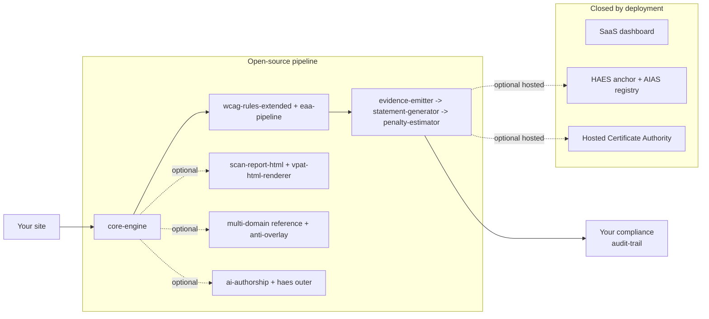

# ariada — EAA-2025 compliance pipeline for your CI

[](https://github.com/ariada-org/ariada/actions/workflows/ci.yml)
[](https://github.com/ariada-org/ariada/actions/workflows/codeql.yml)
[](https://securityscorecards.dev/viewer/?uri=github.com/ariada-org/ariada)
[](https://joinup.ec.europa.eu/collection/eupl)
[](https://api.reuse.software/info/github.com/ariada-org/ariada)
[](https://nodejs.org)
[](https://pnpm.io)
[](https://coderabbit.ai)
[](https://sonarcloud.io/summary/new_code?id=ariada-org_ariada)
[](https://github.com/ariada-org/ariada/commits/main)
[](https://github.com/ariada-org/ariada/commits/main)

Twenty-one MUST-OSS modules covering the full EAA-2025 compliance loop: a 31-rule WCAG 2.2 AA scanner pack extending axe-core, a TypeScript scanner runtime (engine + browser + Playwright adapters), a reusable GitHub Actions workflow + composite Action, an EN 301 549 article 7 statement generator, an 11-jurisdiction penalty estimator, a VPAT 2.5 INT evidence emitter + HTML renderer, single-binary CLI, MCP (Model Context Protocol) server, AI-authorship attribution + tamper-evident evidence ledger, anti-overlay detection library, multi-domain orchestrator reference, differential-gate schema + reference classifier, accessibility-matcher test adapters for five frameworks, and a scan-report HTML renderer. ESM-only, EUPL-1.2 with narrow Article 2 patent peace for OSS users, no telemetry, no account.

For comparison, the dominant accessibility-OSS project — Deque axe-core — ships one rules engine under MPL-2.0. ariada ships twenty-one modules under EUPL-1.2 (plus MIT for brand tokens and CC0-1.0 for fixtures), structured for Cyber Resilience Act (CRA, Regulation (EU) 2024/2847) Open Source Steward eligibility.

EAA enforcement started 28 June 2025. The same engine that fails a pull request also writes the accessibility statement you publish.

```yaml
# .github/workflows/eaa-audit.yml
uses: ariada-org/ariada/.github/workflows/eaa-audit.yml@v0.1.0-rc.1
with:
  urls: ["https://your-site.example/", "https://your-site.example/checkout"]
  locale: sv
```

<!--
Badges below activate once npm packages are published to the registry.
Until then they render "invalid" or "rate limited" which signals broken tooling.

[](https://publint.dev/@ariada-org/wcag-rules-extended)
[](https://www.npmjs.com/package/@ariada-org/wcag-rules-extended)
[](https://bundlephobia.com/package/@ariada-org/wcag-rules-extended)
-->

> Badges for npm packages (publint, version, bundle size) activate after `v0.1.0` is published to the npm registry.

### Test coverage at a glance

| Surface                                         | Tests                          | Browsers                  | Visual regression | Artefacts                                                           |
| ----------------------------------------------- | ------------------------------ | ------------------------- | ----------------- | ------------------------------------------------------------------- |
| Unit (vitest, happy-dom)                        | 1780 across 21 packages        | n/a (synthetic DOM)       | no                | Coverage HTML per package (`coverage/`)                             |
| E2E `@ariada-org/wcag-rules-extended`           | 45 (15 scenarios × 3 engines)  | Chromium, Firefox, WebKit | no                | `playwright-report/`, `test-results/` (30-day retention)            |
| E2E `@ariada-org/scan-flow-ui`                  | 57 (19 scenarios × 3 engines)  | Chromium, Firefox, WebKit | **yes** (18 PNGs) | `playwright-report/`, `test-results/`, `tests/e2e/__screenshots__/` |
| E2E `@ariada-org/core-playwright` (integration) | vitest integration config      | Chromium (CDP fixture)    | no                | `coverage/`                                                         |
| Production smoke (live URLs, post-merge)        | 5 properties × scorecard scan  | Chromium                  | yes               | Uploaded on failure only (14-day retention)                         |
| **Total E2E pass count**                        | **~280 cross-browser per run** |                           |                   |                                                                     |

Workflows: [`ci.yml`](.github/workflows/ci.yml) (build / lint / typecheck / unit) and [`e2e.yml`](.github/workflows/e2e.yml) (Playwright matrix + integration + screenshot evidence). Each E2E run uploads the HTML report, trace files, and screenshots as GitHub Actions artefacts so EAA / EN 301 549 §11 audit-trail reviewers can inspect rendering evidence per browser engine without re-running the suite.

---

## Architecture



ASCII fallback (if Mermaid does not render):

```text
[Your site]
    -> [core-engine]              (scanner runtime: orchestration, fan-out, ScanEvent emission)
        -> [core-browser]         (DOM adapter for Chrome / Edge / Firefox extension)
        -> [core-playwright]      (Node + CDP adapter for CI/CD)
        -> [wcag-rules-extended]  (31 EAA-2025 WCAG 2.2 AA rules)
            -> [eaa-pipeline]     (reusable GitHub Actions workflow)
                -> [evidence-emitter]   (VPAT 2.5 INT + EN 301 549 JSON bundle)
                    -> [statement-generator] (EN 301 549 art. 7 generator)
                        -> [penalty-estimator]  (11-jurisdiction matrix)
                            -> [Your compliance audit-trail]

HYBRID optional stops (commodity-outer OSS, proprietary inner closed):
    -> [scan-report-html + vpat-html-renderer]  (HTML renderers — proprietary template polish closed)
    -> [multi-domain ref]                        (orchestrator closed)
    -> [anti-overlay]                            (threat-intel signal feed closed)
    -> [ai-authorship outer]                     (classifier weights closed)
    -> [haes schema]                             (Merkle-anchor service closed)

Closed by deployment (server-side, not redistributable, not on the publish roadmap):
    [SaaS dashboard] [HAES Merkle anchor + AIAS registry] [Hosted Certificate Authority]
    [Additional closed proprietary cores]
```

Each stop is one package. You can stop at any stop. The rule pack alone is a useful axe-core extension for a frontend developer. Add the reusable workflow and you have a CI gate that fails a pull request when new accessibility issues land. Add the evidence emitter, statement generator, and penalty estimator and the chain produces a procurement-ready bundle a public-sector buyer can paste into a tender response. We built it this way on purpose — every team we audited had a different stopping point, and forcing them to take the whole stack was the fastest way to lose them. In our codebase each stop ships with its own `package.json`, SPDX header, and Changeset entry, so a downstream consumer pins each independently. The wiring is a contract on disk, not a runtime import — the pipeline survives one package being held back a release.

> 📍 **Full architecture + patent + license map:** [ariada.org/architecture](https://ariada.org/architecture) · [ariada.org/patents](https://ariada.org/patents) · [ariada.org/licenses](https://ariada.org/licenses)

---

## Pick your role

| Role                      | Start here                                                                                                                                                                                                              | What you get                                                                                                                                         |
| ------------------------- | ----------------------------------------------------------------------------------------------------------------------------------------------------------------------------------------------------------------------- | ---------------------------------------------------------------------------------------------------------------------------------------------------- |
| Frontend developer        | [`packages/wcag-rules-extended`](./packages/wcag-rules-extended#readme)                                                                                                                                                 | 31 new axe-core rules for WCAG 2.2 AA + EAA gaps                                                                                                     |
| CI engineer               | [`packages/eaa-pipeline`](./packages/eaa-pipeline#readme)                                                                                                                                                               | Reusable workflow: `uses: ariada-org/ariada/.github/workflows/eaa-audit.yml@v0.1.0-rc.1`                                                             |
| Compliance officer        | [`packages/ariada-statement-generator`](./packages/ariada-statement-generator#readme)                                                                                                                                   | EN 301 549 article 7 statement in 8 Nordic / EU languages                                                                                            |
| CFO / SaaS founder        | [`packages/ariada-penalty-estimator`](./packages/ariada-penalty-estimator#readme)                                                                                                                                       | Per-jurisdiction fine ranges across 11 EU member states                                                                                              |
| Public-sector procurement | [`packages/ariada-evidence-emitter`](./packages/ariada-evidence-emitter#readme)                                                                                                                                         | VPAT 2.5 INT bundle, EN 301 549 JSON, signed SBOM                                                                                                    |
| OSS contributor           | `packages/core-engine` + `packages/core-browser` + `packages/core-playwright` plus the six commodity-outer surfaces (`ai-authorship`, `haes`, `multi-domain`, `anti-overlay`, `scan-report-html`, `vpat-html-renderer`) | Inspect, fork, upstream, or repackage the full scanner runtime. EUPL-1.2 narrow Article 2 patent peace attaches to the published OSS implementation. |
| Researcher                | AI-authorship attribution methodology spec + arXiv preprint (planned); HAES (Hash-Anchored Evidence Store) schema for AI Act article 50 disclosure; Pope-Tech-style WebAIM analog (planned)                             | Reference specs, append-only ledger schema, scan-result corpus. Citation-ready under CC-BY-4.0 for prose, EUPL-1.2 for code.                         |

OSS maintainers and downstream packagers: check stars, commit activity, the package-level [LICENSE](./LICENSE) files, [CODE_OF_CONDUCT.md](./CODE_OF_CONDUCT.md), and the REUSE-compliant per-file SPDX headers. Security researchers: read [SECURITY.md](./SECURITY.md) for the disclosure window — reports to `security@ariada.org` (PGP fingerprint in `SECURITY.md`). Grant evaluators: the diagram above is the same one in our NLnet Stage-2 proposal; every numbered stop maps one-to-one to a proposed deliverable milestone.

---

## Quick start

### A. Scan one URL from the terminal

```bash
npx @ariada-org/wcag-rules-extended scan https://example.com
```

Prints a WCAG 2.2 AA report with EAA-specific rule violations. Exit code is non-zero if any rule fails.

### B. CI gate, organisation-wide

Add to `.github/workflows/a11y.yml` in any repo:

```yaml
name: EAA gate
on: [pull_request]
jobs:
  scan:
    uses: ariada-org/ariada/.github/workflows/eaa-audit.yml@v0.1.0-rc.1
    with:
      url: ${{ vars.PREVIEW_URL }}
```

That is the whole file. The reusable workflow installs `@ariada-org/wcag-rules-extended`, runs the scan, posts a PR comment, uploads a SARIF report, and fails the build on any new violation.

### C. Procurement-ready evidence bundle

```bash
npx @ariada-org/evidence-emitter emit \
  --site https://example.com \
  --out ./evidence
```

Writes `vpat-2.5-int.html`, `en-301-549.json`, `statement.md`, `penalty-estimate.json`, and a CycloneDX SBOM (Software Bill of Materials) to `./evidence/`. Hand the folder to your procurement reviewer. We tested the layout against EU Joinup catalogue conventions — the same bundle works for both Swedish DIGG and Norwegian uutilsynet audits.

---

## Packages

A twenty-one-package OSS surface plus the commodity-outer HYBRID packages (OSS surface + closed proprietary core). Shipped rows are present in `packages/` today; planned rows are placeholders on the publish queue. The `Status` column tells you which is which.

### Open-source packages (full source under EUPL-1.2, MIT, or CC0-1.0)

| Package                                                                           | License                      | Status       | What it does                                                                      |
| --------------------------------------------------------------------------------- | ---------------------------- | ------------ | --------------------------------------------------------------------------------- |
| [`@ariada-org/wcag-rules-extended`](./packages/wcag-rules-extended#readme)        | EUPL-1.2                     | shipped v0.1 | 31 EAA-2025 WCAG 2.2 AA rules                                                     |
| [`@ariada-org/eaa-pipeline`](./packages/eaa-pipeline#readme)                      | EUPL-1.2                     | shipped v0.1 | Reusable GitHub Actions workflow                                                  |
| [`@ariada-org/statement-generator`](./packages/ariada-statement-generator#readme) | EUPL-1.2                     | shipped v0.1 | EN 301 549 art. 7 statement generator (8 Nordic / EU locales)                     |
| [`@ariada-org/penalty-estimator`](./packages/ariada-penalty-estimator#readme)     | EUPL-1.2                     | shipped v0.1 | 11-jurisdiction penalty estimator                                                 |
| [`@ariada-org/evidence-emitter`](./packages/ariada-evidence-emitter#readme)       | EUPL-1.2                     | shipped v0.1 | VPAT 2.5 INT + EN 301 549 JSON evidence bundle                                    |
| [`@ariada-org/brand-tokens`](./packages/ariada-brand-tokens#readme)               | **MIT**                      | shipped v0.1 | Zero-runtime CSS design tokens (no logo files)                                    |
| [`@ariada-org/test-fixtures`](./packages/ariada-test-fixtures#readme)             | EUPL-1.2 + CC0-1.0           | shipped v0.1 | EAA-paired HTML corpus + scan-result snapshots                                    |
| [`@ariada-org/core-engine`](./packages/core-engine#readme)                        | EUPL-1.2                     | shipped v0.1 | TypeScript scanner runtime — analyzer fan-out, ScanEvent emission, fingerprinting |
| [`@ariada-org/core-browser`](./packages/core-browser#readme)                      | EUPL-1.2                     | shipped v0.1 | Browser DOM adapter for `core-engine` — Chrome / Edge / Firefox extension target  |
| [`@ariada-org/core-playwright`](./packages/core-playwright#readme)                | EUPL-1.2                     | shipped v0.1 | Node + Chrome DevTools Protocol adapter for `core-engine` — CI/CD target          |
| [`@ariada-org/cli`](./packages/ariada-cli#readme)                                 | EUPL-1.2                     | shipped v0.1 | Single-binary command-line runner (`scan`, `list-rules`, `emit-report`)           |
| [`@ariada-org/mcp-server`](./packages/ariada-mcp-server#readme)                   | EUPL-1.2                     | shipped v0.1 | Model Context Protocol server exposing scanner tools to AI assistants             |
| [`@ariada-org/scan-report-html`](./packages/scan-report-html#readme)              | EUPL-1.2                     | shipped v0.1 | Single-file HTML report renderer for scan artefacts                               |
| [`@ariada-org/vpat-html-renderer`](./packages/ariada-vpat-html-renderer#readme)   | EUPL-1.2                     | shipped v0.1 | VPAT 2.5 INT JSON → WCAG 2.2 AA self-conformant HTML renderer                     |
| [`@ariada-org/ai-authorship`](./packages/ariada-ai-authorship#readme)             | EUPL-1.2                     | shipped v0.1 | Per-code-hunk AI-authorship attribution (EU AI Act Article 50)                    |
| [`@ariada-org/haes`](./packages/ariada-haes#readme)                               | EUPL-1.2                     | shipped v0.1 | Hash-Anchored Evidence Store — tamper-evident AI-artifact ledger                  |
| [`@ariada-org/anti-overlay`](./packages/ariada-anti-overlay#readme)               | EUPL-1.2                     | shipped v0.1 | Detection-only library for third-party accessibility-overlay products             |
| [`@ariada-org/multi-domain`](./packages/ariada-multi-domain#readme)               | EUPL-1.2                     | shipped v0.1 | Single-domain reference orchestrator for cross-regulation scans                   |
| [`@ariada-org/test-adapters`](./packages/ariada-test-adapters#readme)             | EUPL-1.2                     | shipped v0.1 | Accessibility matchers for Jest, Vitest, Mocha + Chai, Playwright, Cypress        |
| [`@ariada-org/diff-schema`](./packages/ariada-diff-schema#readme)                 | EUPL-1.2                     | shipped v0.1 | Finding fingerprint, selector normalisation, DiffResult, BaselinePolicy, SARIF    |
| [`@ariada-org/diff-stub`](./packages/ariada-diff-stub#readme)                     | EUPL-1.2                     | shipped v0.1 | Equality-only reference classifier — explicit «not canonical» banner              |
| [`@ariada-org/diff-action`](./packages/ariada-diff-action#readme)                 | EUPL-1.2                     | shipped v0.1 | Composite GitHub Action wrapping the differential CI gate                         |
| Mindset framework                                                                 | EUPL-1.2 + CC-BY-4.0 (prose) | planned      | Architect-tier accessible-design framework                                        |
| Anti-overlay explainer                                                            | CC-BY-4.0                    | planned      | Public-interest explainer on overlay-product risk                                 |

### HYBRID (commodity-outer OSS + closed proprietary core)

These ship a substantial OSS surface under EUPL-1.2 (or MIT where licensing constraints differ) while reserving algorithmic cores as closed proprietary code. Same-pattern precedents: Deque axe-core MPL-2.0 + axe DevTools Pro IGTs (Intelligent Guided Tests); GitLab MIT Community Edition + Enterprise add-ons.

| Package / Module                    | License (outer)  | Status               | OSS surface                                                                                                                                                 | Closed core                                                               |
| ----------------------------------- | ---------------- | -------------------- | ----------------------------------------------------------------------------------------------------------------------------------------------------------- | ------------------------------------------------------------------------- |
| CI/CD differential gate             | EUPL-1.2 (outer) | shipped v0.1 (outer) | `@ariada-org/eaa-pipeline` reusable Action + `@ariada-org/diff-action` composite + `@ariada-org/diff-schema` + `@ariada-org/diff-stub` reference classifier | Differential threshold semantics + canonical pre-existing-violation diff  |
| AI-authorship attribution           | EUPL-1.2 (outer) | shipped v0.1 (outer) | `@ariada-org/ai-authorship` methodology + JSON schema + reference implementation                                                                            | Trained classifier weights + signal-weight tuning                         |
| HAES authorship-evidence ledger     | EUPL-1.2 (outer) | shipped v0.1 (outer) | `@ariada-org/haes` hash-anchored append-only event-ledger schema (AI Act art. 50)                                                                           | Canonical AIAS registry service + Merkle-anchor service                   |
| Multi-domain scanner orchestrator   | EUPL-1.2 (outer) | shipped v0.1 (outer) | `@ariada-org/multi-domain` single-domain single-regulation reference orchestrator                                                                           | Multi-standard orchestrator + cross-regulation evidence-emission pipeline |
| Anti-overlay detection              | EUPL-1.2 (outer) | shipped v0.1 (outer) | `@ariada-org/anti-overlay` detection-only library for third-party overlay products                                                                          | Threat-intel signal feed + remediation playbook                           |
| Character-themed scan visualisation | **MIT** (outer)  | planned              | Visualisation library + scan-flow base components (URL input, progress, scorecard)                                                                          | Character renderer + animation layer                                      |

### Out-of-OSS-surface (closed by deployment — not redistributable)

The hosted multi-tenant SaaS surface (dashboard, single-sign-on, audit-log export, hosted Certificate Authority, HAES Merkle-anchor service, AIAS canonical registry) and additional closed algorithmic cores (cross-tool canonical scoring, tiered LLM cascade, MIP + machine-learning backlog optimiser, cross-deployment regression) are not OSS packages. They are not in the `packages/` tree, they are not on npm, and they are not on the publish roadmap. They are listed here so the boundary is visible — every self-hosting adopter can run the full open-source pipeline on their own infrastructure without any of them.

All TypeScript packages are ESM-only and ship type declarations. Node 22 LTS is the supported runtime. We publish from this monorepo using Changesets and signed npm trusted-publisher provenance (OIDC, OpenID Connect, no long-lived tokens). Each release attaches a CycloneDX SBOM and an SPDX expression so REUSE audits verify obligations without cloning. We migrated to OIDC after one too many evenings rotating tokens by hand — the provenance attestation is what NLnet Stage-2 reviewers asked for the same week as a German procurement auditor.

---

## Why this exists

The European Accessibility Act (EAA, Directive 2019/882/EU) became enforceable on 28 June 2025. From that date, private-sector e-commerce, banking, transport, e-books, and consumer hardware sold to EU residents must meet WCAG 2.2 AA harmonised with EN 301 549 v3.2.1. National regulators in SE (DIGG), DE (BFSG), FR (DGCCRF, ARCOM), DK (Digitaliseringsstyrelsen), and NO (uutilsynet) can issue fines, ban sales, and require remediation plans.

The current state of the open web makes this hard. The WebAIM Million 2025 audit found 96.3 percent of the top one million home pages have detectable WCAG failures — average 51 errors per page. Most teams discover their exposure during a procurement review, not during a sprint.

ariada is the open-source workbench that puts the EAA pipeline inside the development loop. We wrote each rule so it maps back to a clause in EN 301 549 and to the WCAG 2.2 success criterion it inherits from — a remediation ticket carries the regulatory citation by construction. The project is developed in alignment with the NLnet (Stichting NLnet, the Dutch foundation funding public-interest internet infrastructure) Commons Fund mission to keep core internet infrastructure in public hands.

---

## Standards covered

| Standard              | Version                                                                                                                        | Scope                                                                             |
| --------------------- | ------------------------------------------------------------------------------------------------------------------------------ | --------------------------------------------------------------------------------- |
| WCAG                  | 2.2 AA                                                                                                                         | Web Content Accessibility Guidelines, W3C Recommendation 2023-10                  |
| EN 301 549            | v3.2.1 (2021-03)                                                                                                               | ETSI European harmonised accessibility standard cited in the EAA implementing act |
| EAA Annex I           | Directive 2019/882/EU                                                                                                          | Functional accessibility requirements for products and services                   |
| Nordic transpositions | DOS-lagen (SE), Likestillings- og diskrimineringsloven (NO), Bekendtgørelse om webtilgængelighed (DK), Saavutettavuuslaki (FI) | National-law mappings with per-jurisdiction enforcement bodies                    |

Per-rule citations live in the `wcag-rules-extended` package documentation. Each violation produced by the scanner carries both a WCAG success-criterion identifier and the corresponding EN 301 549 clause, so a triage workflow can sort tickets by regulator priority without a manual lookup table.

v0.1 does not yet cover the transport-specific clauses of EAA Annex I §I.5.

---

## Roadmap

| Quarter    | Status         | Scope                                                                                                                                                                                                                                                                                                                                                                                                                                                                                                                                                                                                                                            |
| ---------- | -------------- | ------------------------------------------------------------------------------------------------------------------------------------------------------------------------------------------------------------------------------------------------------------------------------------------------------------------------------------------------------------------------------------------------------------------------------------------------------------------------------------------------------------------------------------------------------------------------------------------------------------------------------------------------ |
| Q2 2026    | ✅ shipped     | Twenty-one OSS packages: 31-rule WCAG 2.2 AA scanner pack, scanner runtime (engine + browser + Playwright adapters), reusable GitHub Actions workflow + composite Action, EN 301 549 art. 7 statement generator, 11-jurisdiction penalty estimator, VPAT 2.5 INT evidence emitter + HTML renderer, single-binary CLI, MCP server, AI-authorship attribution + HAES evidence ledger, anti-overlay detection, multi-domain orchestrator reference, differential-gate schema + reference classifier, accessibility-matcher test adapters for five frameworks, scan-report HTML renderer. Public repo + first npm release candidate (`v0.1.0-rc.1`). |
| Q3 2026    | 🚧 in progress | Stable v0.1.0 release across all twenty-one packages. Documentation site (Starlight + Pagefind). VS Code extension (`@ariada-org/vscode-extension`) inline diagnostics. Intelligent-Guided-Test (IGT) design work. Field-validation track on 1K labelled EU SMB sites.                                                                                                                                                                                                                                                                                                                                                                           |
| Q4 2026    | 📋 planned     | Mindset framework public release (architect-tier accessible-design framework). Anti-overlay explainer page. Multi-fund expansion (Sovereign Tech Fund, EUIPO SME Fund follow-on). Cross-domain analyzer plugin contract (sustainability / Core Web Vitals / SEO / GDPR as plugins of the same scanner runtime).                                                                                                                                                                                                                                                                                                                                  |
| Q1–Q2 2027 | 📋 planned     | First commercial customer reference deployments. Firefox extension target. Multi-language docs (Swedish, German, French, Danish, Norwegian, Finnish, Dutch, Italian). Regulatory-context Model Context Protocol resources.                                                                                                                                                                                                                                                                                                                                                                                                                       |

---

## Governance

- Maintainer: Alexander Brichkin (Agonist Development AB, Sweden, org.nr 559452-5726)
- Contributions: see [CONTRIBUTING.md](./CONTRIBUTING.md)
- Conduct: [Contributor Covenant 2.1](./CODE_OF_CONDUCT.md)
- Security disclosures: [SECURITY.md](./SECURITY.md), `security@ariada.org`
- License: EUPL-1.2 ([text](./LICENSE)), per-package overrides noted in the packages table above
