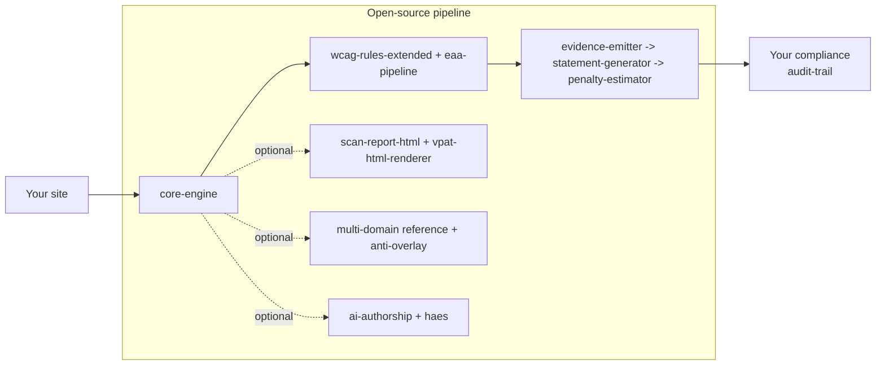

# ariada — EAA-2025 compliance pipeline for your CI

[](https://github.com/ariada-org/ariada/actions/workflows/ci.yml)
[](https://github.com/ariada-org/ariada/actions/workflows/lighthouse.yml)
[](https://codecov.io/gh/ariada-org/ariada)
[](https://securityscorecards.dev/viewer/?uri=github.com/ariada-org/ariada)
[](https://joinup.ec.europa.eu/collection/eupl)
[](https://api.reuse.software/info/github.com/ariada-org/ariada)
[](https://app.fossa.com/projects/git%2Bgithub.com%2Fariada-org%2Fariada)
<!-- SWHID-placeholder: replace with the Software Heritage badge after the archive save returns a SWHID. -->
[](https://nodejs.org)
[](https://pnpm.io)
[](https://coderabbit.ai)
[](https://nlnet.nl/commonsfund/)

**Website: [ariada.org](https://ariada.org)** · [Module catalog](#module-catalog) · [Architecture](https://ariada.org/architecture) · [Standards](#standards-covered) · [Docs](./docs/)

An open-source toolkit covering the full EAA-2025 compliance loop: a 31-rule WCAG 2.2 AA scanner pack extending axe-core, a TypeScript scanner runtime (engine + browser + Playwright adapters), a reusable GitHub Actions workflow + composite Action, an EN 301 549 article 7 statement generator, an 11-jurisdiction penalty estimator, a VPAT 2.5 INT evidence emitter + HTML renderer, single-binary CLI, MCP (Model Context Protocol) server, AI-authorship attribution + tamper-evident evidence ledger, anti-overlay detection library, multi-domain orchestrator reference, differential-gate schema + reference classifier, accessibility-matcher test adapters for five frameworks, framework build-tool plugins, and a scan-report HTML renderer. ESM-only, EUPL-1.2 with narrow Article 2 patent peace for users, no telemetry, no account.

For comparison, the dominant accessibility-OSS project — Deque axe-core — ships one rules engine under MPL-2.0. ariada ships a whole compliance loop under EUPL-1.2 (plus MIT for brand tokens and CC0-1.0 for fixtures), structured for Cyber Resilience Act (CRA, Regulation (EU) 2024/2847) Open Source Steward eligibility. Every package in this repository is open-source-licensed (EUPL-1.2, MIT, or CC0-1.0) and self-hostable.

EAA enforcement started 28 June 2025. The same engine that fails a pull request also writes the accessibility statement you publish.

```yaml
# .github/workflows/eaa-audit.yml
uses: ariada-org/ariada/.github/workflows/eaa-audit.yml@v0.1.0-rc.1
with:
  urls: ["https://your-site.example/", "https://your-site.example/checkout"]
  locale: sv
```

[](./LICENSE)

## Dogfooding — ariada audits ariada (progressive wiring)

The reusable workflow at `ariada-org/ariada/.github/workflows/eaa-audit.yml` that downstream consumers pin via `uses:` is the same workflow we run against our own OSS landing at `ariada.org`. The dogfooding loop is shipping in stages — building blocks first, the per-pull-request blocking gate as part of milestone-1.

**Wired today** (verifiable on this repo at the time you are reading): reusable `eaa-audit.yml` workflow + `dogfood-self-scan.yml` weekly cron + `scripts/self-cert-ariada-org.mjs` static-DOM scanner producing timestamped Markdown + JSON artefacts under `audits/self-cert/` + accessibility statement template at `ariada.org/accessibility/` consuming those artefacts with honest disclosure of detected items.

**Not yet wired** (milestone-1 path): tightening `fail-on` from `critical` to `serious,critical` and wiring as PR-blocking gate; first publish of `@ariada-org/wcag-rules-extended` to npm (the dogfood workflow currently builds the rule pack from the local workspace); automatic accessibility-statement regeneration on each rule-pack version bump.

**Multi-domain extension** (milestone-2 path): the `@ariada-org/multi-domain` package today is a **single-jurisdiction reference orchestrator** plus a published `JurisdictionPlugin` extension contract. Multi-jurisdiction execution in a single pass, and community-authored plugins for Canadian AODA + Japanese JIS X 8341-3, are explicit roadmap items in that package's README.

Standards basis: EAA Directive (EU) 2019/882 Article 13 (service-provider obligation) + Article 14 (fundamental-alteration / disproportionate-burden disclosure) + WCAG 2.2 §5.4 + §5.5 (Statement of Partial Conformance) + EN 301 549 v3.2.1 + Directive (EU) 2016/2102 Article 7. Reproduction recipe (`node scripts/self-cert-ariada-org.mjs` after `pnpm install` + `pnpm --filter ariada-org build`) and the full current-vs-roadmap split per loop block are in [`docs/dogfooding.md`](./docs/dogfooding.md). **The authoritative current state of which loop blocks are wired on any given day is this README's architecture diagram below — kept in lock-step with the actual workflow files in `.github/workflows/`.**

<!--
Deferred-activation badge stack — uncomment block below on first public push.
Each URL has been authored to resolve once the matching service connection lands;
until then they would render "no data" or 404 which hurts trust more than absence.

[](https://github.com/ariada-org/ariada/actions/workflows/ci.yml)
[](https://github.com/ariada-org/ariada/actions/workflows/codeql.yml)
[](https://scorecard.dev/viewer/?uri=github.com/ariada-org/ariada)
[](https://www.bestpractices.dev/projects/<INSERT_BP_ID_HERE>)
[](https://coderabbit.ai)
[](https://api.reuse.software/info/github.com/ariada-org/ariada)
[](https://sonarcloud.io/summary/new_code?id=ariada-org_ariada)
[](https://publint.dev/@ariada-org/wcag-rules-extended)
[](https://www.npmjs.com/package/@ariada-org/wcag-rules-extended)
[](https://bundlephobia.com/package/@ariada-org/wcag-rules-extended)
-->

> Additional badges (OSSF Scorecard, Codecov, REUSE, FOSSA, Sigstore, publint, Bundlephobia, SonarCloud, Snyk, CodeRabbit, OpenSSF Best Practices) activate after first public push + the corresponding third-party service connections.

### Test coverage at a glance

| Surface                                         | Tests                          | Browsers                  | Visual regression | Artefacts                                                           |
| ----------------------------------------------- | ------------------------------ | ------------------------- | ----------------- | ------------------------------------------------------------------- |
| Unit (vitest, happy-dom)                        | 1780 across 21 packages        | n/a (synthetic DOM)       | no                | Coverage HTML per package (`coverage/`)                             |
| E2E `@ariada-org/wcag-rules-extended`           | 45 (15 scenarios × 3 engines)  | Chromium, Firefox, WebKit | no                | `playwright-report/`, `test-results/` (30-day retention)            |
| E2E `@ariada-org/scan-flow-ui`                  | 57 (19 scenarios × 3 engines)  | Chromium, Firefox, WebKit | **yes** (18 PNGs) | `playwright-report/`, `test-results/`, `tests/e2e/__screenshots__/` |
| E2E `@ariada-org/core-playwright` (integration) | vitest integration config      | Chromium (CDP fixture)    | no                | `coverage/`                                                         |
| Production smoke (live URLs, post-merge)        | 5 properties × scorecard scan  | Chromium                  | yes               | Uploaded on failure only (14-day retention)                         |
| **Total E2E pass count**                        | **~280 cross-browser per run** |                           |                   |                                                                     |

Workflows: [`ci.yml`](.github/workflows/ci.yml) (build / lint / typecheck / unit) and [`e2e.yml`](.github/workflows/e2e.yml) (Playwright matrix + integration + screenshot evidence). Each E2E run uploads the HTML report, trace files, and screenshots as GitHub Actions artefacts so EAA / EN 301 549 §11 audit-trail reviewers can inspect rendering evidence per browser engine without re-running the suite.

---

## Architecture



ASCII fallback (if Mermaid does not render):

```text
[Your site]
    -> [core-engine]              (scanner runtime: orchestration, fan-out, ScanEvent emission)
        -> [core-browser]         (DOM adapter for Chrome / Edge / Firefox extension)
        -> [core-playwright]      (Node + CDP adapter for CI/CD)
        -> [wcag-rules-extended]  (31 EAA-2025 WCAG 2.2 AA rules)
            -> [eaa-pipeline]     (reusable GitHub Actions workflow)
                -> [evidence-emitter]   (VPAT 2.5 INT + EN 301 549 JSON bundle)
                    -> [statement-generator] (EN 301 549 art. 7 generator)
                        -> [penalty-estimator]  (11-jurisdiction matrix)
                            -> [Your compliance audit-trail]

Optional stops (each is its own package, take it or leave it):
    -> [scan-report-html + vpat-html-renderer]  (human-readable HTML reports)
    -> [multi-domain reference]                 (cross-regulation orchestrator reference)
    -> [anti-overlay]                           (third-party overlay detection)
    -> [ai-authorship + haes]                   (AI-authorship attribution + tamper-evident ledger)
```

Each stop is one package. You can stop at any stop. The rule pack alone is a useful axe-core extension for a frontend developer. Add the reusable workflow and you have a CI gate that fails a pull request when new accessibility issues land. Add the evidence emitter, statement generator, and penalty estimator and the chain produces a procurement-ready bundle a public-sector buyer can paste into a tender response. We built it this way on purpose — every team we audited had a different stopping point, and forcing them to take the whole stack was the fastest way to lose them. In our codebase each stop ships with its own `package.json`, SPDX header, and Changeset entry, so a downstream consumer pins each independently. The wiring is a contract on disk, not a runtime import — the pipeline survives one package being held back a release.

> 📍 **Full architecture + patent + license map:** [ariada.org/architecture](https://ariada.org/architecture) · [ariada.org/patents](https://ariada.org/patents) · [ariada.org/licenses](https://ariada.org/licenses)

---

## Pick your role

| Role                      | Start here                                                                                                                                                                                                              | What you get                                                                                                                                         |
| ------------------------- | ----------------------------------------------------------------------------------------------------------------------------------------------------------------------------------------------------------------------- | ---------------------------------------------------------------------------------------------------------------------------------------------------- |
| Frontend developer        | [`packages/wcag-rules-extended`](./packages/wcag-rules-extended#readme)                                                                                                                                                 | 31 new axe-core rules for WCAG 2.2 AA + EAA gaps                                                                                                     |
| CI engineer               | [`packages/eaa-pipeline`](./packages/eaa-pipeline#readme)                                                                                                                                                               | Reusable workflow: `uses: ariada-org/ariada/.github/workflows/eaa-audit.yml@v0.1.0-rc.1`                                                             |
| Compliance officer        | [`packages/ariada-statement-generator`](./packages/ariada-statement-generator#readme)                                                                                                                                   | EN 301 549 article 7 statement in 8 Nordic / EU languages                                                                                            |
| Finance / budget owner    | [`packages/ariada-penalty-estimator`](./packages/ariada-penalty-estimator#readme)                                                                                                                                       | Per-jurisdiction fine ranges across 11 EU member states                                                                                              |
| Public-sector procurement | [`packages/ariada-evidence-emitter`](./packages/ariada-evidence-emitter#readme)                                                                                                                                         | VPAT 2.5 INT bundle, EN 301 549 JSON, signed SBOM                                                                                                    |
| OSS contributor           | `packages/core-engine` + `packages/core-browser` + `packages/core-playwright` plus the reporting and analysis surfaces (`ai-authorship`, `haes`, `multi-domain`, `anti-overlay`, `scan-report-html`, `vpat-html-renderer`) | Inspect, fork, upstream, or repackage the full scanner runtime. EUPL-1.2 narrow Article 2 patent peace attaches to the published implementation. |
| Researcher                | AI-authorship attribution methodology spec + arXiv preprint (planned); HAES (Hash-Anchored Evidence Store) schema for AI Act article 50 disclosure; WebAIM-style analysis (planned)                             | Reference specs, append-only ledger schema, scan-result corpus. Citation-ready under CC-BY-4.0 for prose, EUPL-1.2 for code.                         |

OSS maintainers and downstream packagers: check stars, commit activity, the package-level [LICENSE](./LICENSE) files, [CODE_OF_CONDUCT.md](./CODE_OF_CONDUCT.md), and the REUSE-compliant per-file SPDX headers. Security researchers: read [SECURITY.md](./SECURITY.md) for the disclosure window — reports to `security@ariada.org` (PGP fingerprint in `SECURITY.md`). Grant evaluators: every numbered stop in the diagram above maps one-to-one to a planned, publicly-verifiable deliverable.

---

## Quick start

### A. Scan one URL from the terminal

```bash
npx @ariada-org/wcag-rules-extended scan https://example.com
```

Prints a WCAG 2.2 AA report with EAA-specific rule violations. Exit code is non-zero if any rule fails.

### B. CI gate, organisation-wide

Add to `.github/workflows/a11y.yml` in any repo:

```yaml
name: EAA gate
on: [pull_request]
jobs:
  scan:
    uses: ariada-org/ariada/.github/workflows/eaa-audit.yml@v0.1.0-rc.1
    with:
      url: ${{ vars.PREVIEW_URL }}
```

That is the whole file. The reusable workflow installs `@ariada-org/wcag-rules-extended`, runs the scan, posts a PR comment, uploads a SARIF report, and fails the build on any new violation.

### C. Procurement-ready evidence bundle

```bash
npx @ariada-org/evidence-emitter emit \
  --site https://example.com \
  --out ./evidence
```

Writes `vpat-2.5-int.html`, `en-301-549.json`, `statement.md`, `penalty-estimate.json`, and a CycloneDX SBOM (Software Bill of Materials) to `./evidence/`. Hand the folder to your procurement reviewer. We tested the layout against EU Joinup catalogue conventions — the same bundle works for both Swedish DIGG and Norwegian uutilsynet audits.

---

## Packages

<!-- ariada-bus:catalog:start (managed — do not edit by hand; run `node scripts/ariada-bus-catalog.mjs --fix`) -->
### Module catalog

86 packages in the tree (71 publish-eligible, 59 published to npm, 27 source-only). This table is generated from each package.json plus the live npm registry — it cannot go stale by hand.

| Package | Published (npm) | What it does |
|---|---|---|
| [`@ariada-org/admin-surface`](./packages/admin-surface#readme) | source-only | Product-neutral contracts for validated KlarAds admin surfaces, locale registries, colour fields, and contextual help. |
| [`@ariada-org/admin-svelte`](./packages/admin-svelte#readme) | source-only | Shared Svelte 5 render layer for Agonist admin surfaces: contract-driven AG Grid, declarative charts, design tokens. The Svelte twin of @ariada-org/admin-ui. |
| [`@ariada-org/ai-authorship`](./packages/ariada-ai-authorship#readme) | `0.1.0` | AI authorship attribution — per-finding classifier for source code hunks. Multi-signal ensemble (lexical entropy + AST shape + naming cadence + edit-history rhythm) with calibrated posteriors. EU AI Act Article 50 transparency commodity surface. Open source under EUPL-1.2. |
| [`@ariada-org/angular-builder`](./packages/ariada-angular-builder#readme) | `0.1.0` | Angular CLI builder and schematic helpers for scanning build output with Ariada. |
| [`@ariada-org/anti-overlay`](./packages/ariada-anti-overlay#readme) | `0.1.0` | Detection + machine-readable reporting of third-party accessibility-overlay widgets with verbatim citation of W3C-WAI and OverlayFactsheet community positions. Detection only — non-judgement-prescriptive. Open source under EUPL-1.2. |
| [`@ariada-org/ariada-extension`](./packages/ariada-extension#readme) | source-only | Chrome (Manifest V3) side-panel extension that scans the active tab against multiple compliance domains in one shared DOM pass, with user-pluggable domain modules. |
| [`@ariada-org/ariada-jsr`](./packages/ariada-jsr#readme) | `0.1.0` | JSR-facing TypeScript adapter that builds shared @ariada-org/cli scanner commands for Deno and TS-first consumers. |
| [`@ariada-org/ariada-precommit`](./packages/ariada-precommit#readme) | `1.0.0` | pre-commit and Husky wrapper for running ariada accessibility gates on staged HTML and template files. |
| [`@ariada-org/astro`](./packages/ariada-astro#readme) | `0.1.0` | Astro integration that scans built HTML with Ariada and writes accessibility reports at build completion. |
| [`@ariada-org/axe-ruleset`](./packages/ariada-axe-ruleset#readme) | source-only | Axe-core configuration payload for Ariada's existing WCAG rules and checks. |
| [`@ariada-org/babel-plugin`](./packages/ariada-babel-plugin#readme) | `0.1.0` | Babel plugin adapter for source-visible Ariada JSX accessibility checks. |
| [`@ariada-org/bitbucket-pipe`](./packages/ariada-bitbucket-pipe#readme) | source-only | Bitbucket Pipe for the Ariada differential accessibility gate. |
| [`@ariada-org/blamer-api-client`](./packages/blamer-api-client#readme) | `0.1.0` | Typed HTTP client for the differential attribution API. Wraps @ariada-org/ai-authorship types. Usable standalone in any pipeline that needs AI-versus-human authorship analysis of code diffs. |
| [`@ariada-org/blamer-github-app`](./packages/blamer-github-app#readme) | source-only | GitHub App webhook handler for Blamer — receives pull_request events, calls the Blamer attribution API, posts check runs and PR comments. Internal package. |
| [`@ariada-org/blamer-vercel-integration`](./packages/blamer-vercel-integration#readme) | source-only | Vercel Integration webhook handler for Blamer — receives deployment.succeeded events, calls the Blamer attribution API, posts deploy comments and optional blocking checks. Internal package. |
| [`@ariada-org/brand`](./packages/brand#readme) | source-only | Ariadne's Thread — brand logo files (trademark-restricted). The CSS design tokens were extracted to @ariada-org/brand-tokens (MIT) in v0.2.0. |
| [`@ariada-org/brand-tokens`](./packages/ariada-brand-tokens#readme) | `0.1.0` | Ariadne's Thread design tokens (CSS-only) — typography, spacing, radius, colour ramps. MIT-licensed for permissive downstream reuse. Logo files NOT included (trademark-restricted). |
| [`@ariada-org/bus`](./packages/ariada-bus#readme) | `0.1.0` | Typed check/fix reconciliation primitives for Ariada facts. |
| [`@ariada-org/circleci-orb`](./packages/ariada-circleci-orb#readme) | source-only | CircleCI orb source for the Ariada differential accessibility gate. |
| [`@ariada-org/clamper`](./packages/ariada-clamper#readme) | source-only | Deterministic validation for Ariada public module catalogs and related public artifacts. |
| [`@ariada-org/cli`](./packages/ariada-cli#readme) | `0.3.0` | Single-binary command-line runner for the ariada OSS accessibility scanner pipeline — scan URLs, list rules, emit reports. Open source under EUPL-1.2. |
| [`@ariada-org/config`](./packages/config#readme) | source-only |  |
| [`@ariada-org/content-policy`](./packages/ariada-content-policy#readme) | `0.1.0` | Composable content-policy gate — evaluate text against rule-pack profiles per publish surface, emitting a GateDecision verdict. Open source under EUPL-1.2. |
| [`@ariada-org/control-room`](./packages/ariada-control-room#readme) | source-only | Pure view engine that turns a control-room snapshot into lamp-scored status tiles. |
| [`@ariada-org/core`](./packages/core#readme) | `0.1.2` | Backwards-compat shim — re-exports @ariada-org/core-engine + @ariada-org/core-playwright. New code should import the engine and an adapter directly. |
| [`@ariada-org/core-browser`](./packages/core-browser#readme) | `0.1.1` | In-browser DOM adapter for @ariada-org/core-engine — used by the ariada Chrome extension to scan the live document without Node or Playwright. |
| [`@ariada-org/core-engine`](./packages/core-engine#readme) | `0.3.0` | Pure-runtime ariada scanner engine — analyzer fan-out, ScanEvent emission, scoring, fingerprinting, registry, cross-domain detection. No Node, browser, or Playwright deps. |
| [`@ariada-org/core-playwright`](./packages/core-playwright#readme) | `0.3.0` | Node + Playwright adapter for @ariada-org/core-engine — browser launch, CDP snapshot, captureSnapshot, and the canonical scan() entry point. |
| [`@ariada-org/cypress-ariada`](./packages/cypress-ariada#readme) | `0.1.1` | Cypress custom command and Node task for running Ariada accessibility scans from Cypress suites. |
| [`@ariada-org/diff-action`](./packages/ariada-diff-action#readme) | `0.1.0` | Composite GitHub Action wrapper for the differential accessibility CI gate. Open source under EUPL-1.2. |
| [`@ariada-org/diff-schema`](./packages/ariada-diff-schema#readme) | `0.2.0` | Differential accessibility CI gate — finding fingerprint, selector normalisation, DiffResult, BaselinePolicy and GateDecision schemas with reference validators. Open source under EUPL-1.2. |
| [`@ariada-org/diff-stub`](./packages/ariada-diff-stub#readme) | `0.1.1` | Equality-only OSS reference classifier for the differential accessibility CI gate. NOT canonical — does not emit near-duplicate matches. Open source under EUPL-1.2. |
| [`@ariada-org/docusaurus-plugin`](./packages/ariada-docusaurus-plugin#readme) | `0.1.0` | Docusaurus plugin that scans static build output with Ariada. |
| [`@ariada-org/dracula-agent`](./packages/dracula-agent#readme) | `0.1.1` | ​Rive + GSAP Dracula character layer for draculascan. Plugs into ScanProgress.characterSlot. |
| [`@ariada-org/eaa-pipeline-meta`](./packages/eaa-pipeline#readme) | source-only | Metadata for the ariada-org/ariada reusable GitHub Actions workflow (eaa-audit.yml). Not published to npm — the artefact is the workflow YAML itself. |
| [`@ariada-org/eleventy-plugin`](./packages/ariada-eleventy-plugin#readme) | `0.1.0` | Eleventy plugin that scans generated site output with Ariada. |
| [`@ariada-org/embed-badge`](./packages/embed-badge#readme) | `0.1.0` | <ariada-badge> Web Component — shared bundle, brand via data-theme attribute. Shadow-DOM isolated. |
| [`@ariada-org/esbuild-plugin`](./packages/ariada-esbuild-plugin#readme) | `0.1.0` | esbuild plugin that scans emitted HTML with Ariada accessibility checks. |
| [`@ariada-org/eslint-plugin-a11y`](./packages/eslint-plugin-ariada-a11y#readme) | `0.1.0` | ESLint 9 flat-config plugin for source-detectable ariada accessibility checks. |
| [`@ariada-org/event-bus`](./packages/ariada-event-bus#readme) | source-only | Event publisher and subscription adapters for Ariada product events. |
| [`@ariada-org/event-contracts`](./packages/ariada-event-contracts#readme) | source-only | Typed product event contracts and runtime validation for Ariada integrations. |
| [`@ariada-org/evidence-emitter`](./packages/ariada-evidence-emitter#readme) | `0.1.0` | EAA / WCAG compliance evidence emitters — VPAT 2.5, EN 301 549 §11, Swedish DOS-lagen. Open source under EUPL-1.2. |
| [`@ariada-org/extension-chrome`](./packages/extension-chrome#readme) | source-only | ariada — Dracula scans the web. Chrome MV3 extension that runs the @ariada-org/core-browser scanner in-page and visualises violations via an animated overlay. |
| [`@ariada-org/figma-plugin`](./packages/ariada-figma-plugin#readme) | `0.1.0` | Figma plugin for local Ariada design accessibility checks. |
| [`@ariada-org/gatsby-plugin`](./packages/ariada-gatsby-plugin#readme) | `0.1.0` | Gatsby plugin that scans public build output with Ariada accessibility checks. |
| [`@ariada-org/gitlab-component`](./packages/ariada-gitlab-component#readme) | source-only | GitLab CI/CD component for the Ariada differential accessibility gate. |
| [`@ariada-org/haes`](./packages/ariada-haes#readme) | `0.1.0` | Hash-anchored Evidence Stream — tamper-evident append-only ledger for AI-artifact transparency under EU Regulation 2024/1689 Article 50. Schema + reference client + Merkle anchor primitives. Open source under EUPL-1.2. |
| [`@ariada-org/lighthouse-plugin`](./packages/ariada-lighthouse-plugin#readme) | source-only | Lighthouse plugin that adapts configured Ariada scan output into conformance audits. |
| [`@ariada-org/live-room`](./packages/live-room#readme) | source-only | Framework-neutral-ish Svelte 5 Live Audit Room: a three-pane shell (subject in the centre, catalog on the left, streaming findings on the right) with a live-focus connector, for any auditor front-end. Apache-2.0 so any project can reuse it without copyleft. |
| [`@ariada-org/loop-runner`](./packages/ariada-loop-runner#readme) | source-only | Internal dogfood loop runner that turns a content-policy gate failure into attribution, a Reverter remediation plan, and a recorded fact. |
| [`@ariada-org/mcp-server`](./packages/ariada-mcp-server#readme) | `0.1.0` | Model Context Protocol (MCP) server exposing the ariada OSS accessibility scanner pipeline as discoverable tools for AI coding assistants. Open source under EUPL-1.2. |
| [`@ariada-org/monitoring-sample`](./packages/ariada-monitoring-sample#readme) | source-only | Page-sample selection for the EU public-sector accessibility monitoring methodology (Commission Implementing Decision (EU) 2018/1524, Annex I). Pure, explainable, reproducible. Open source under EUPL-1.2. |
| [`@ariada-org/multi-domain`](./packages/ariada-multi-domain#readme) | `0.1.2` | Single-jurisdiction accessibility-scan reference implementation plus extension API for community-authored jurisdiction rule packs. Open source under EUPL-1.2. |
| [`@ariada-org/netlify-plugin`](./packages/ariada-netlify-plugin#readme) | `0.1.0` | Netlify Build Plugin that scans the published site with the ariada accessibility CLI after build. |
| [`@ariada-org/nextjs-plugin`](./packages/ariada-nextjs-plugin#readme) | `0.1.0` | Next.js integration that scans exported or built HTML with Ariada accessibility checks. |
| [`@ariada-org/nuxt-module`](./packages/ariada-nuxt-module#readme) | `0.1.0` | Nuxt module that scans generated output with Ariada accessibility checks. |
| [`@ariada-org/otel`](./packages/ariada-otel#readme) | source-only | OpenTelemetry metrics and spans for existing Ariada CLI scan results. |
| [`@ariada-org/overlay`](./packages/overlay#readme) | `0.2.0` | Fully abstract in-page finding overlay: the engine resolves findings to live element rectangles; a pluggable painter decides what is drawn (boxes, connector lines to blocks, or a mascot that flies element to element — Dracula, Thumbelina, anyone). |
| [`@ariada-org/penalty-estimator`](./packages/ariada-penalty-estimator#readme) | `0.1.0` | EAA / national-law penalty exposure estimator — per-jurisdiction administrative-fine rate-cards (SE/NO/DK/FI/DE/FR/NL/AT/CH/UK/EU). Open source under EUPL-1.2. |
| [`@ariada-org/playwright-ariada`](./packages/playwright-ariada#readme) | source-only | Playwright fixture, assertion, scan adapter, and reporter for Ariada scans. |
| [`@ariada-org/postcss-plugin`](./packages/ariada-postcss-plugin#readme) | `0.1.0` | PostCSS 8 plugin adapter for Ariada CSS-domain accessibility checks. |
| [`@ariada-org/qwik-plugin`](./packages/ariada-qwik-plugin#readme) | `0.1.0` | Qwik City Vite plugin wrapper that scans generated output with Ariada. |
| [`@ariada-org/remix-plugin`](./packages/ariada-remix-plugin#readme) | `0.1.0` | Remix and React Router framework Vite plugin wrapper for Ariada scans. |
| [`@ariada-org/reverter-adapter`](./packages/ariada-reverter-adapter#readme) | source-only | Webhook adapter for the accessibility fix-PR integration — parses check_run and deployment_status events, converts findings into clusters, and calls the hosted remediation cascade endpoint. Internal package. |
| [`@ariada-org/rollup-plugin`](./packages/ariada-rollup-plugin#readme) | `0.1.0` | Rollup plugin that scans emitted HTML with Ariada accessibility checks. |
| [`@ariada-org/rules-axe`](./packages/rules-axe#readme) | `0.2.1` | axe-core-powered a11y DomainAnalyzer for @ariada-org/core |
| [`@ariada-org/scan-backend`](./packages/scan-backend#readme) | `0.2.1` | Runtime-agnostic Hono router factory + schemas + auth + scoring helpers. Consumed by services/backend (Node) and previously by CF Workers (now removed). |
| [`@ariada-org/scan-flow-ui`](./packages/scan-flow-ui#readme) | `0.1.1` | Brand-themed React components shared by ariada-web and draculascan: URLInput, ScanProgress, Scorecard, ShareButtons, CrossSellCTAs. |
| [`@ariada-org/scan-report-html`](./packages/scan-report-html#readme) | `0.2.0` | Renders machine-readable accessibility scan artefacts into a single self-contained human-readable HTML report. Closes the gap between scan-results.json and what an auditor / developer / compliance officer can actually read. |
| [`@ariada-org/selenium-ariada`](./packages/selenium-ariada#readme) | source-only | Selenium CDP accessibility-tree and axe adapter with Ariada CLI fallback. |
| [`@ariada-org/solidstart-plugin`](./packages/ariada-solidstart-plugin#readme) | `0.1.0` | SolidStart Vite plugin wrapper that scans generated output with Ariada. |
| [`@ariada-org/statement-generator`](./packages/ariada-statement-generator#readme) | `0.1.0` | EAA / WCAG accessibility-statement generator — Directive 2016/2102 art. 7-style statement pages in HTML or MDX. Nordic 4 + English locales. Open source under EUPL-1.2. |
| [`@ariada-org/storybook-addon`](./packages/ariada-storybook-addon#readme) | `0.1.0` | Storybook addon that runs Ariada accessibility checks on rendered stories and reports findings in a panel. |
| [`@ariada-org/surface-browser`](./packages/surface-browser#readme) | `0.1.1` | In-browser surface adapter for @ariada-org/core-engine — bookmarklet, DevTools panel entry point, and importable ES module for multi-domain compliance scanning in any browser context. |
| [`@ariada-org/sveltekit-plugin`](./packages/ariada-sveltekit-plugin#readme) | `0.1.0` | SvelteKit Vite plugin wrapper that scans build output with Ariada. |
| [`@ariada-org/swc-plugin`](./packages/ariada-swc-plugin#readme) | `0.1.0` | JavaScript-side SWC pipeline wrapper for Ariada static JSX accessibility checks. |
| [`@ariada-org/test-adapters`](./packages/ariada-test-adapters#readme) | `0.1.1` | Accessibility-assertion adapters for Jest, Vitest, Mocha (Chai plugin), Playwright (fixture) and Cypress (custom command). Wraps @ariada-org/core-playwright + @ariada-org/wcag-rules-extended. Open source under EUPL-1.2. |
| [`@ariada-org/test-fixtures`](./packages/ariada-test-fixtures#readme) | `0.2.0` | Curated HTML fixtures + golden snapshots for accessibility rule testing — generic axe-core cases plus EU real-world patterns (Klarna/BankID/MobilePay/Mittelstand/RGAA). HTML fixtures dedicated to the public domain (CC0-1.0); fixture-server source code under EUPL-1.2. |
| [`@ariada-org/url-guard`](./packages/url-guard#readme) | `0.1.0` | Shared SSRF guard — reject non-http(s) schemes and resolve+validate hostnames against loopback/private/link-local/reserved ranges, returning a pinned IP so callers can close DNS-rebinding. Open source under EUPL-1.2. |
| [`@ariada-org/vite-plugin`](./packages/ariada-vite-plugin#readme) | `0.1.0` | Vite plugin that scans dev HTML and production build output with Ariada accessibility checks. |
| [`@ariada-org/vpat-html-renderer`](./packages/ariada-vpat-html-renderer#readme) | `0.1.0` | Renders VPAT 2.5 INT JSON reports into self-contained, WCAG 2.2 AA-conformant, print-friendly HTML for procurement, regulatory audit, and vendor-website publication. |
| [`@ariada-org/vscode-extension`](./packages/vscode-extension#readme) | source-only | Visual Studio Code extension surfacing accessibility findings inline in HTML, JSX, TSX, Vue, Svelte, and Angular templates. Open source under EUPL-1.2. |
| [`@ariada-org/wcag-rules-extended`](./packages/wcag-rules-extended#readme) | `0.1.0` | EAA 2025-ready WCAG 2.2 AA rule packs extending axe-core. Open source under EUPL-1.2. |
| [`@ariada-org/wdio-ariada-service`](./packages/wdio-ariada-service#readme) | source-only | WebdriverIO service and scan adapter for Ariada accessibility reports. |
| [`@ariada-org/webpack-plugin`](./packages/ariada-webpack-plugin#readme) | `0.1.0` | Webpack plugin that scans emitted HTML with Ariada accessibility checks. |
| [`ariada-domain-fixture`](./packages/ariada-domain-fixture#readme) | `1.0.0` | Minimal fixture domain module for testing npm-convention domain discovery in the ariada domain-contract acceptance suite. |
<!-- ariada-bus:catalog:end -->


A twenty-one-package OSS surface plus the commodity-outer HYBRID packages (OSS surface + closed proprietary core). Shipped rows are present in `packages/` today; planned rows are placeholders on the publish queue. The `Status` column tells you which is which.

### Module catalog

| Package | Status | What it does |
|---|---|---|
| [`@ariada-org/ai-authorship`](./packages/ariada-ai-authorship#readme) | publish-eligible | AI authorship attribution — per-finding classifier for source code hunks. Multi-signal ensemble (lexical entropy + AST shape + naming cadence + edit-history rhythm) with calibrated posteriors. EU AI Act Article 50 transparency surface. Open source under EUPL-1.2. |
| [`@ariada-org/anti-overlay`](./packages/ariada-anti-overlay#readme) | publish-eligible | Detection + machine-readable reporting of third-party accessibility-overlay widgets with verbatim citation of W3C-WAI and OverlayFactsheet community positions. Detection only. Open source under EUPL-1.2. |
| [`@ariada-org/astro`](./packages/ariada-astro#readme) | publish-eligible | Astro integration that scans built HTML with Ariada and writes accessibility reports at build completion. |
| [`@ariada-org/blamer-api-client`](./packages/blamer-api-client#readme) | publish-eligible | Typed HTTP client for the differential authorship-attribution API. Wraps @ariada-org/ai-authorship types. Usable standalone in any pipeline that needs AI-versus-human authorship analysis of code diffs. |
| [`@ariada-org/blamer-github-app`](./packages/blamer-github-app#readme) | source-only | GitHub App webhook handler — receives pull_request events, runs authorship attribution, and posts check runs and PR comments. |
| [`@ariada-org/blamer-vercel-integration`](./packages/blamer-vercel-integration#readme) | source-only | Vercel Integration webhook handler — receives deployment.succeeded events, runs authorship attribution, and posts deploy comments and optional blocking checks. |
| [`@ariada-org/brand`](./packages/brand#readme) | source-only | Ariadne's Thread — brand logo files (trademark-restricted). The CSS design tokens were extracted to @ariada-org/brand-tokens (MIT) in v0.2.0. |
| [`@ariada-org/brand-tokens`](./packages/ariada-brand-tokens#readme) | publish-eligible | Ariadne's Thread design tokens (CSS-only) — typography, spacing, radius, colour ramps. MIT-licensed for permissive downstream reuse. Logo files NOT included (trademark-restricted). |
| [`@ariada-org/bus`](./packages/ariada-bus#readme) | publish-eligible | Typed check/fix reconciliation primitives for Ariada facts. |
| [`@ariada-org/cli`](./packages/ariada-cli#readme) | publish-eligible | Single-binary command-line runner for the ariada OSS accessibility scanner pipeline — scan URLs, list rules, emit reports. Open source under EUPL-1.2. |
| [`@ariada-org/content-policy`](./packages/ariada-content-policy#readme) | publish-eligible | Composable content-policy gate — evaluate text against rule-pack profiles per publish surface, emitting a GateDecision verdict. Open source under EUPL-1.2. |
| [`@ariada-org/core-browser`](./packages/core-browser#readme) | publish-eligible | In-browser DOM adapter for @ariada-org/core-engine — used by the ariada Chrome extension to scan the live document without Node or Playwright. |
| [`@ariada-org/core-engine`](./packages/core-engine#readme) | publish-eligible | Pure-runtime ariada scanner engine — analyzer fan-out, ScanEvent emission, scoring, fingerprinting, registry, cross-domain detection. No Node, browser, or Playwright deps. |
| [`@ariada-org/core-playwright`](./packages/core-playwright#readme) | publish-eligible | Node + Playwright adapter for @ariada-org/core-engine — browser launch, CDP snapshot, captureSnapshot, and the canonical scan() entry point. |
| [`@ariada-org/diff-action`](./packages/ariada-diff-action#readme) | publish-eligible | Composite GitHub Action wrapper for the differential accessibility CI gate. Open source under EUPL-1.2. |
| [`@ariada-org/diff-schema`](./packages/ariada-diff-schema#readme) | publish-eligible | Differential accessibility CI gate — finding fingerprint, selector normalisation, DiffResult, BaselinePolicy and GateDecision schemas with reference validators. Open source under EUPL-1.2. |
| [`@ariada-org/diff-stub`](./packages/ariada-diff-stub#readme) | publish-eligible | Equality-only OSS reference classifier for the differential accessibility CI gate. NOT canonical — does not emit near-duplicate matches. Open source under EUPL-1.2. |
| [`ariada-domain-fixture`](./packages/ariada-domain-fixture#readme) | publish-eligible | Minimal fixture domain module for testing npm-convention domain discovery in the ariada domain-contract acceptance suite. |
| [`@ariada-org/eaa-pipeline-meta`](./packages/eaa-pipeline#readme) | source-only | Metadata for the ariada-org/ariada reusable GitHub Actions workflow (eaa-audit.yml). Not published to npm — the artefact is the workflow YAML itself. |
| [`@ariada-org/evidence-emitter`](./packages/ariada-evidence-emitter#readme) | publish-eligible | EAA / WCAG compliance evidence emitters — VPAT 2.5, EN 301 549 §11, Swedish DOS-lagen. Open source under EUPL-1.2. |
| [`@ariada-org/ariada-extension`](./packages/ariada-extension#readme) | source-only | Chrome (Manifest V3) side-panel extension that scans the active tab against multiple compliance domains in one shared DOM pass, with user-pluggable domain modules. |
| [`@ariada-org/haes`](./packages/ariada-haes#readme) | publish-eligible | Hash-anchored Evidence Stream — tamper-evident append-only ledger for AI-artifact transparency under EU Regulation 2024/1689 Article 50. Schema + reference client + Merkle-anchor primitives. Open source under EUPL-1.2. |
| [`@ariada-org/loop-runner`](./packages/ariada-loop-runner#readme) | source-only | Self-audit loop runner that turns a content-policy gate failure into an attribution, a remediation plan, and a recorded fact. |
| [`@ariada-org/mcp-server`](./packages/ariada-mcp-server#readme) | publish-eligible | Model Context Protocol (MCP) server exposing the ariada OSS accessibility scanner pipeline as discoverable tools for AI coding assistants. Open source under EUPL-1.2. |
| [`@ariada-org/multi-domain`](./packages/ariada-multi-domain#readme) | publish-eligible | Single-jurisdiction accessibility-scan reference implementation plus extension API for community-authored jurisdiction rule packs. Open source under EUPL-1.2. |
| [`@ariada-org/penalty-estimator`](./packages/ariada-penalty-estimator#readme) | publish-eligible | EAA / national-law penalty exposure estimator — per-jurisdiction administrative-fine rate-cards (SE/NO/DK/FI/DE/FR/NL/AT/CH/UK/EU). Open source under EUPL-1.2. |
| [`@ariada-org/reverter-adapter`](./packages/ariada-reverter-adapter#readme) | source-only | Webhook adapter for the accessibility fix-PR integration — parses check_run and deployment_status events and converts findings into remediation clusters. |
| [`@ariada-org/scan-report-html`](./packages/scan-report-html#readme) | publish-eligible | Renders machine-readable accessibility scan artefacts into a single self-contained human-readable HTML report. Closes the gap between scan-results.json and what an auditor / developer / compliance officer can actually read. |
| [`@ariada-org/statement-generator`](./packages/ariada-statement-generator#readme) | publish-eligible | EAA / WCAG accessibility-statement generator — Directive 2016/2102 art. 7-style statement pages in HTML or MDX. Nordic 4 + English locales. Open source under EUPL-1.2. |
| [`@ariada-org/storybook-addon`](./packages/ariada-storybook-addon#readme) | publish-eligible | Storybook addon that runs Ariada accessibility checks on rendered stories and reports findings in a panel. |
| [`@ariada-org/surface-browser`](./packages/surface-browser#readme) | publish-eligible | In-browser surface adapter for @ariada-org/core-engine — bookmarklet, DevTools panel entry point, and importable ES module for multi-domain compliance scanning in any browser context. |
| [`@ariada-org/test-adapters`](./packages/ariada-test-adapters#readme) | publish-eligible | Accessibility-assertion adapters for Jest, Vitest, Mocha (Chai plugin), Playwright (fixture) and Cypress (custom command). Wraps @ariada-org/core-playwright + @ariada-org/wcag-rules-extended. Open source under EUPL-1.2. |
| [`@ariada-org/test-fixtures`](./packages/ariada-test-fixtures#readme) | publish-eligible | Curated HTML fixtures + golden snapshots for accessibility rule testing — generic axe-core cases plus EU real-world patterns (Klarna/BankID/MobilePay/Mittelstand/RGAA). HTML fixtures dedicated to the public domain (CC0-1.0); fixture-server source code under EUPL-1.2. |
| [`@ariada-org/vite-plugin`](./packages/ariada-vite-plugin#readme) | publish-eligible | Vite plugin that scans dev HTML and production build output with Ariada accessibility checks. |
| [`@ariada-org/vpat-html-renderer`](./packages/ariada-vpat-html-renderer#readme) | publish-eligible | Renders VPAT 2.5 INT JSON reports into self-contained, WCAG 2.2 AA-conformant, print-friendly HTML for procurement, regulatory audit, and vendor-website publication. |
| [`@ariada-org/vscode-extension`](./packages/vscode-extension#readme) | source-only | Visual Studio Code extension surfacing accessibility findings inline in HTML, JSX, TSX, Vue, Svelte, and Angular templates. Open source under EUPL-1.2. |
| [`@ariada-org/wcag-rules-extended`](./packages/wcag-rules-extended#readme) | publish-eligible | EAA 2025-ready WCAG 2.2 AA rule packs extending axe-core. Open source under EUPL-1.2. |

All TypeScript packages are ESM-only and ship type declarations. Node 22 LTS is the supported runtime. We publish from this monorepo using Changesets and signed npm trusted-publisher provenance (OIDC, OpenID Connect, no long-lived tokens). Each release attaches a CycloneDX SBOM and an SPDX expression so REUSE audits verify obligations without cloning. We migrated to OIDC after one too many evenings rotating tokens by hand — the provenance attestation is the kind of supply-chain guarantee grant reviewers and procurement auditors increasingly expect.

---

## Why this exists

The European Accessibility Act (EAA, Directive 2019/882/EU) became enforceable on 28 June 2025. From that date, private-sector e-commerce, banking, transport, e-books, and consumer hardware sold to EU residents must meet WCAG 2.2 AA harmonised with EN 301 549 v3.2.1. National regulators in SE (DIGG), DE (BFSG), FR (DGCCRF, ARCOM), DK (Digitaliseringsstyrelsen), and NO (uutilsynet) can issue fines, ban sales, and require remediation plans.

The current state of the open web makes this hard. The WebAIM Million 2025 audit found 96.3 percent of the top one million home pages have detectable WCAG failures — average 51 errors per page. Most teams discover their exposure during a procurement review, not during a sprint.

ariada is the open-source workbench that puts the EAA pipeline inside the development loop. We wrote each rule so it maps back to a clause in EN 301 549 and to the WCAG 2.2 success criterion it inherits from — a remediation ticket carries the regulatory citation by construction. We have submitted a funding proposal to the NLnet (Stichting NLnet, the Dutch foundation funding public-interest internet infrastructure) Commons Fund — a decision is pending — because keeping core internet infrastructure in public hands is that fund's mission and ours.

---

## Standards covered

| Standard              | Version                                                                                                                        | Scope                                                                             |
| --------------------- | ------------------------------------------------------------------------------------------------------------------------------ | --------------------------------------------------------------------------------- |
| WCAG                  | 2.2 AA                                                                                                                         | Web Content Accessibility Guidelines, W3C Recommendation 2023-10                  |
| EN 301 549            | v3.2.1 (2021-03)                                                                                                               | ETSI European harmonised accessibility standard cited in the EAA implementing act |
| EAA Annex I           | Directive 2019/882/EU                                                                                                          | Functional accessibility requirements for products and services                   |
| Nordic transpositions | DOS-lagen (SE), Likestillings- og diskrimineringsloven (NO), Bekendtgørelse om webtilgængelighed (DK), Saavutettavuuslaki (FI) | National-law mappings with per-jurisdiction enforcement bodies                    |

Per-rule citations live in the `wcag-rules-extended` package documentation. Each violation produced by the scanner carries both a WCAG success-criterion identifier and the corresponding EN 301 549 clause, so a triage workflow can sort tickets by regulator priority without a manual lookup table.

v0.1 does not yet cover the transport-specific clauses of EAA Annex I §I.5.

---

## Roadmap

| Quarter    | Status         | Scope                                                                                                                                                                                                                                                                                                                                                                                                                                                                                                                                                                                                                                            |
| ---------- | -------------- | ------------------------------------------------------------------------------------------------------------------------------------------------------------------------------------------------------------------------------------------------------------------------------------------------------------------------------------------------------------------------------------------------------------------------------------------------------------------------------------------------------------------------------------------------------------------------------------------------------------------------------------------------ |
| Q2 2026    | ✅ shipped     | Core compliance modules: 31-rule WCAG 2.2 AA scanner pack, scanner runtime (engine + browser + Playwright adapters), reusable GitHub Actions workflow + composite Action, EN 301 549 art. 7 statement generator, 11-jurisdiction penalty estimator, VPAT 2.5 INT evidence emitter + HTML renderer, single-binary CLI, MCP server, AI-authorship attribution + HAES evidence ledger, anti-overlay detection, multi-domain orchestrator reference, differential-gate schema + reference classifier, accessibility-matcher test adapters for five frameworks, scan-report HTML renderer. Public repo + first npm release candidate (`v0.1.0-rc.1`). |
| Q3 2026    | 🚧 in progress | Stable v0.1.0 release across all packages. Documentation site (Starlight + Pagefind). VS Code extension (`@ariada-org/vscode-extension`) inline diagnostics. Framework build-tool adapters (Astro, Vite, Storybook). Field-validation track on 1K labelled EU SMB sites.                                                                                                                                                                                                                                                                                                                                                                        |
| Q4 2026    | 📋 planned     | Accessible-design framework public release. Anti-overlay explainer page. Multi-fund expansion (Sovereign Tech Fund, EUIPO SME Fund follow-on). Cross-domain analyzer plugin contract (sustainability / Core Web Vitals / SEO / GDPR as plugins of the same scanner runtime).                                                                                                                                                                                                                                                                                                                                                                    |
| Q1–Q2 2027 | 📋 planned     | First external reference deployments. Firefox extension target. Multi-language docs (Swedish, German, French, Danish, Norwegian, Finnish, Dutch, Italian). Regulatory-context Model Context Protocol resources.                                                                                                                                                                                                                                                                                                                                                                                                                                 |

---

## Governance

- Maintainer: Alexander Brichkin (Agonist Development AB, Sweden, org.nr 559452-5726)
- Website: [ariada.org](https://ariada.org)
- Contributions: see [CONTRIBUTING.md](./CONTRIBUTING.md)
- Conduct: [Contributor Covenant 2.1](./CODE_OF_CONDUCT.md)
- Security disclosures: [SECURITY.md](./SECURITY.md), `security@ariada.org`
- License: EUPL-1.2 ([text](./LICENSE)), per-package licences noted in the module catalog above
