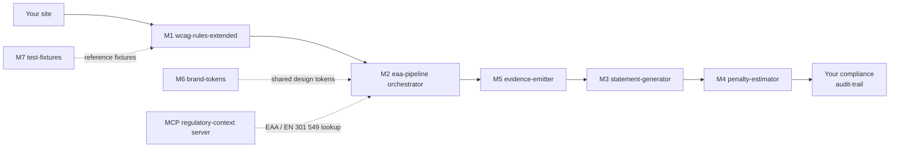

# PLATFORM_SPEC — ariada accessibility-compliance pipeline

| Field | Value |
|---|---|
| **Status** | DRAFT v0.1 |
| **Date** | 2026-05-17 |
| **Author** | Alexander Brichkin (Agonist Development AB, Sweden, org.nr 559452-5726) |
| **Scope** | Public architecture specification for the open-source surface of the ariada platform |
| **Audience** | NLnet (Stichting NLnet) NGI0 (Next Generation Internet Zero) Commons Fund evaluators; downstream OSS (open-source software) contributors and adopters |
| **License (this document)** | CC-BY-4.0 (Creative Commons Attribution 4.0 International) |

---

## §1 Purpose & scope

This document specifies what the ariada platform is, how its components fit together, and which parts are published as open source under which licences. It is the canonical public reference for adopters who need to decide whether to install one of the published packages, contribute upstream, or fork the work.

The document covers: the platform mission and the regulatory problem it addresses; the M1-M7 module pipeline; the per-component classification (open-source obligation, license, publication location); the contracts between components; runtime expectations; extension points; standards alignment; the Stage-2 expansion track; and governance.

The document deliberately excludes: commercial pricing, revenue models, sales funnels, competitive positioning vs proprietary vendors, internal roadmap dates, and any patent claim text. Those are addressed in separate internal documents under the maintainer's portfolio and are not relevant to the public OSS surface a contributor or evaluator inspects.

---

## §2 Platform mission

The European Accessibility Act (EAA — Directive 2019/882/EU of the European Parliament and of the Council) became enforceable on 28 June 2025. From that date, private-sector providers of e-commerce, banking, transport, e-books, and consumer hardware sold to EU residents must demonstrate conformance with WCAG 2.2 AA (Web Content Accessibility Guidelines) as harmonised by EN 301 549 v3.2.1 (ETSI — European Telecommunications Standards Institute — harmonised standard for accessibility requirements). National enforcement bodies in Sweden (DIGG, Myndigheten för digital förvaltning), Germany (Bundesfachstelle Barrierefreiheit under BFSG, the Barrierefreiheitsstärkungsgesetz), France (DGCCRF and ARCOM), Denmark (Digitaliseringsstyrelsen), Norway (uutilsynet), and equivalents in the other 25 EU and EEA jurisdictions issue findings, require remediation plans, and may levy administrative fines.

The current state of the open web makes this difficult to operationalise. The WebAIM Million 2025 audit found 96.3 percent of the top one million home pages have detectable WCAG failures, averaging 51 errors per page. Most teams discover their exposure during a procurement review or after a regulator letter, not during a sprint.

ariada is an open-source pipeline that puts EAA-aligned accessibility checks inside the development loop. The pipeline runs in continuous integration, fails a pull request when new violations land, generates the EN 301 549 article 7 accessibility statement that the same regulator expects to find published on the site, and emits a procurement-ready evidence bundle. Each stage is independently usable; downstream teams adopt as much of the pipeline as their context requires.

The project is positioned as a public-interest internet-infrastructure contribution. Accessibility compliance is a regulatory baseline, not a competitive feature; the tooling that lets small and medium-sized organisations meet that baseline without a paid consultancy belongs in the public commons.

---

## §3 Architecture overview

The platform decomposes into a seven-module pipeline (M1 through M7) plus shared infrastructure. Each module is a separately versioned package with its own SPDX (Software Package Data Exchange) headers and its own Changesets entry. A consumer can adopt any contiguous subset; the contracts between modules are file-on-disk artefacts, not in-process imports, so the pipeline degrades gracefully when one stage is held back a release.



ASCII fallback (if Mermaid does not render):

```text
[Your site]
    -> [M1 wcag-rules-extended]        WCAG 2.2 AA + EAA-gap rules
        -> [M2 eaa-pipeline]           Reusable GitHub Actions workflow
            -> [M5 evidence-emitter]   VPAT 2.5 INT + EN 301 549 JSON
                -> [M3 statement-generator]   EN 301 549 article 7
                    -> [M4 penalty-estimator]   Per-jurisdiction fines
                        -> [Your compliance audit-trail]

Shared:
    [M6 brand-tokens]                  Zero-runtime CSS design tokens
    [M7 test-fixtures]                 EAA-paired HTML corpus
    [MCP regulatory-context server]    Stage-2: regulation-text lookup
```

### §3.1 Pipeline reading

1. **M1 — `@ariada-org/wcag-rules-extended`** scans an HTML target (URL, local file, or rendered Astro/Next/Vue output). It applies 31 axe-core compatible rules covering the EAA-relevant WCAG 2.2 AA criteria plus Nordic-locale gap rules.
2. **M2 — `@ariada-org/eaa-pipeline`** is a reusable GitHub Actions workflow that wraps M1 + downstream stages. A consumer adds a single `uses:` line to a workflow file in their own repository.
3. **M5 — `@ariada-org/evidence-emitter`** consumes the M1 scan results and writes a procurement-grade evidence bundle: VPAT 2.5 INT (Voluntary Product Accessibility Template, International edition), the EN 301 549 JSON representation, a CycloneDX SBOM (Software Bill of Materials) of the scanner itself, and an evidence-bundle manifest with content hashes.
4. **M3 — `@ariada-org/statement-generator`** produces the public EN 301 549 article 7 accessibility statement in the relevant locale, deriving status (full / partial / non-conformant) from the evidence bundle. Statements are deterministic — the same input bundle produces byte-identical output.
5. **M4 — `@ariada-org/penalty-estimator`** computes per-jurisdiction administrative-fine exposure ranges from the unremediated violation set. Each jurisdiction has a YAML rate card with the national ceiling, the enforcement body, and the per-violation versus per-incident calculation rule.
6. **M6 — `@ariada-org/brand-tokens`** is a zero-runtime CSS package providing the design tokens (colour ramp, type scale, spacing) used by every downstream consumer. The tokens ship under MIT to maximise reuse downstream; trademarked logo files are not part of the package.
7. **M7 — `@ariada-org/test-fixtures`** is a reference corpus of HTML fixtures paired with expected scan results. Contributors add fixtures; rule authors use the corpus for regression testing.

Stages 1, 2, 3, 4, 5 are sequential in the canonical pipeline. Stages 6 and 7 are shared across the pipeline. The MCP (Model Context Protocol — the open protocol for connecting AI assistants to data sources, see §6.4) regulatory-context server is a Stage-2 expansion-track component (§10) that lets a consumer query EAA, EN 301 549, and national-transposition text inline with their development tooling.

### §3.2 Stopping points

The pipeline supports natural stopping points. A frontend developer fixing a sprint ticket may use only M1. A platform team adding a CI gate uses M1 plus M2. A compliance officer publishing the article 7 statement uses M1 plus M2 plus M5 plus M3. A public-sector procurement team responding to a tender uses the full chain. The packaging discipline (one `package.json` per stage, no cross-stage runtime imports) makes the stopping points first-class — adopting more of the pipeline does not require unwinding the earlier adoption.

---

## §3.5 Patent-licensed OSS pattern

The platform follows the **patent-licensed OSS** pattern — an open-source publication discipline in which the maintainer holds patent rights to specific algorithmic contributions, releases substantial commodity-outer surface (including the **full TypeScript scanner runtime stack** — engine, browser adapter, and Playwright adapter) under an OSS licence carrying an explicit patent grant, and relies on that grant to give downstream OSS users **patent peace** while preserving enforceability against non-OSS commercial competitors. The pattern is not unique to this project. It is the same posture used by Deque Systems for the axe-core accessibility engine (MPL-2.0 — Mozilla Public License version 2.0, which carries an explicit patent grant under §2.1) alongside Deque's accessibility-related patent portfolio: the full axe-core engine ships as OSS, and Deque monetises on operations (axe DevTools Pro, IGT — Intelligent Guided Test — library, enterprise-tier services) rather than on closing the engine. The same posture appears across mainstream open-core leaders: GitLab Inc. (MIT licensed Community Edition + patented enterprise-tier extensions), Sentry (Functional Source License since 2024 + earlier BSL — Business Source Licence — with patent grants), PostHog (MIT + Apache-2.0 modules), and Mattermost (MIT + AGPL-3.0 — Affero General Public License — Team Edition). In each case the licence-grant patent-peace clause does the work: OSS users get a guaranteed-irrevocable patent licence scoped to use of the OSS code; the maintainer's portfolio remains enforceable against forks or rebuilds that step outside the licensed work.

The TypeScript distribution model makes this pattern structurally inevitable for the scanner runtime stack: an npm-distributed TypeScript package ships readable JavaScript source into every `node_modules/` directory that installs it. A license restriction on the package is **not** the same as technical secrecy — the code is readable regardless of licence. The honest framing is therefore: the TS scanner engine, browser adapter, and Playwright adapter are OSS by distribution model, governed by EUPL-1.2 with the Article 2 patent-peace grant attached. The moat lives on operations, brand, hosted services, and the closed algorithmic cores under Patents C / D / A / F — not on the TS runtime.

### §3.5.1 Why EUPL-1.2 Article 2 is the right fit

EUPL-1.2 — European Union Public Licence version 1.2, published by the European Commission and recognised by the Open Source Initiative — carries a narrower patent grant than Apache-2.0 or MPL-2.0. Article 2 final paragraph grants the Licensee «royalty-free, non-exclusive usage rights to any patents held by the Licensor, to the extent necessary to make use of the rights granted on the Work under this Licence». Three properties of this grant matter for the platform:

1. **Patent peace for OSS users.** Anyone using EUPL-1.2-licensed code receives an irrevocable royalty-free patent licence covering the maintainer's patents to the extent necessary to exercise the EUPL rights on the released Work. A developer running the OSS pipeline in their own continuous-integration workflow faces zero patent-litigation risk from the maintainer's portfolio. A community fork that stays within the licensed scope inherits the same peace.

2. **Moat preservation against non-OSS commercial competitors.** The «to the extent necessary» language is materially narrower than Apache-2.0 §3's enumerated «make, use, sell, offer to sell, have made, import» grant. A commercial competitor cannot fork the OSS surface and use the fork as a back-door licence to commercialise techniques covered by the closed core. The patent grant is structurally tied to the Work that is actually released — not to the maintainer's full algorithmic territory.

3. **EU sovereignty optics + CRA alignment.** EUPL-1.2 is published in twenty-three EU official languages with each version legally equivalent, accepted by national public-sector procurement frameworks, and maps cleanly onto the documentation expectations the CRA — Cyber Resilience Act, Regulation (EU) 2024/2847 — places on OSS modules under the Article 24 Open Source Steward category (see §11.4 and §11.8).

### §3.5.2 What is released, what is reserved

Some parts of the platform are released and some are held back, and the line
between them is drawn once and applied everywhere: **the surface is open, the
part that took the research is not**.

Released, in full, under EUPL-1.2: the scanner engine and its browser and
Playwright adapters, the rule packs, the reusable pipeline workflow, the
command-line tool, the report renderer, the evidence schemas and every format a
consumer has to read or write. Anything an integrator needs in order to run a
scan, read its findings, or build on top is in the open surface.

Held back: the parts where the work was in deciding *how*, rather than in the
interface. A classifier's trained weights and the tuning of its signals, where
the specification and a reference single-signal implementation are open. The
multi-standard orchestrator behind the open single-domain scan. The differential
thresholds and the baseline comparison behind the open pipeline gate. The
normalisation that makes two different scanners comparable, the registry that
gives a rule its provenance across deployments, the routing of a tiered model
cascade, and the scheduler that decides what to fix first.

The pattern is the same in each case: what a consumer must be able to read is
open, and what a competitor would otherwise have to invent is not. A component
being closed is not a statement that the open part is a demonstration — the open
part is what the project runs on, and is used unmodified in production.

Patent claim text is not reproduced in this document or in any public OSS surface. The OSS modules ship without reference to specific claims; the patent grant under EUPL-1.2 Article 2 attaches automatically by operation of the licence.

### §3.5.3 Scenario C confirmed 2026-05-19

The five-bucket classification in §4 (Scenario C: 16 MUST-OSS / 6 HYBRID / 1 KEEP-PROPRIETARY / 2 PATENT-BLOCKED-closed / 1 RETIRE, before counting Stage-2 expansion-track and competitive-gap rows) was selected over two alternatives — Scenario A (maximum-OSS, exposes all patent commodity outers as reference implementations) and Scenario B (minimum-OSS, frontend and scanner only) — by founder direction on 2026-05-19 after a multi-day classification review. Scenario C balances NLnet / Sovereign Tech Fund grant uplift, EU public-sector procurement compatibility, CRA Open Source Steward dual-classification eligibility, and preservation of the patent portfolio against non-OSS commercial competitors. The full rationale and rejection reasoning for Scenarios A and B is documented in the internal classification rationale.

---

## §4 Component classification

Twenty-two baseline components have been inventoried across the platform; thirteen additional components have been identified from the 2026-05-18 competitive-gap analysis (master-strategy memo §3.3). Each component is classified into one of five buckets under the Scenario C posture confirmed 2026-05-19 (see §3.5.3):

- **MUST-OSS** — fully open-source surface published under EUPL-1.2 (or MIT / CC0-1.0 for non-patent-bound commodity surface). Table-stakes infrastructure, the full TypeScript scanner runtime stack (engine, browser adapter, Playwright adapter — OSS by distribution model per §3.5), plus competitive-gap rows where shipping OSS yields differentiation against closed-source competitors.
- **HYBRID** — commodity-outer OSS surface under EUPL-1.2 with the patented algorithmic core retained as closed proprietary code. Applies to five of the nine patent areas (G / J / K / H / B); the OSS surface alone is sufficient for downstream OSS users to exercise patent peace under EUPL-1.2 Article 2 (see §3.5).
- **KEEP-PROPRIETARY** — the hosted multi-tenant SaaS surface plus trademark-bound assets. Closed by deployment (multi-tenant operations) and by trademark law (logos / word-marks). Described by name so the boundary is transparent.
- **PATENT-BLOCKED (closed)** — narrow algorithms covered by the maintainer's patent portfolio that have no commodity-outer extraction path under Scenario C. Two patent areas (D, C) sit here because of identified prior-art collisions where the OSS reference implementation would erode freedom-to-operate.
- **RETIRE** — components superseded by other modules and scheduled for removal.

The classification source is the internal master-strategy classification review and the per-module licence-choice rationale. Per-component patent linkage is documented internally.

### §4.1 MUST-OSS components (sixteen)

Fully open-source modules. EUPL-1.2 for compliance logic, rule packs, scanner runtime stack, and reusable workflow surface; MIT for commodity design tokens; CC0-1.0 for the test-fixture corpus.

| ID | Component | Layer | Licence | Published location | Purpose |
|---|---|---|---|---|---|
| M1 | `@ariada-org/wcag-rules-extended` | Detect | EUPL-1.2 | `packages/wcag-rules-extended/` | 31 WCAG 2.2 AA rules + EAA-gap pack |
| M2 | `@ariada-org/eaa-pipeline` | Orchestration | EUPL-1.2 | `packages/eaa-pipeline/` | Reusable GitHub Actions workflow (the open outer layer of the pipeline gate) |
| M3 | `@ariada-org/statement-generator` | Compliance | EUPL-1.2 | `packages/ariada-statement-generator/` | EN 301 549 article 7 statement generator |
| M4 | `@ariada-org/penalty-estimator` | Compliance | EUPL-1.2 | `packages/ariada-penalty-estimator/` | Per-jurisdiction fine estimator |
| M5 | `@ariada-org/evidence-emitter` | Compliance | EUPL-1.2 | `packages/ariada-evidence-emitter/` | VPAT 2.5 INT + EN 301 549 JSON evidence bundle |
| M6 | `@ariada-org/brand-tokens` | Shared | MIT | `packages/ariada-brand-tokens/` | Zero-runtime CSS design tokens (no logo files) |
| M7 | `@ariada-org/test-fixtures` | Test corpus | EUPL-1.2 (code) + CC0-1.0 (HTML corpus) | `packages/ariada-test-fixtures/` | EAA-paired HTML corpus + scan-result snapshots |
| C0 | `@ariada-org/core-engine` | Detect (scanner runtime core) | EUPL-1.2 | `packages/core-engine/` | TypeScript scanner orchestration core. OSS by distribution model (npm-distributed TS = readable JS source on install); moat lives on hosted operations + closed algorithmic cores (Patents C / D / A / F), not on the runtime engine. |
| C1 | `@ariada-org/core-browser` | Detect (DOM adapter) | EUPL-1.2 | `packages/core-browser/` | DOM adapter for the Chrome extension; commodity surface (Microsoft Insights ships analog under MIT) |
| C2 | `@ariada-org/core-playwright` | Detect (Node + Chrome DevTools Protocol) | EUPL-1.2 | `packages/core-playwright/` | Playwright + CDP adapter for Node-side scans |
| L1 | L0 Mindset framework | Architect (Documentation) | EUPL-1.2 (code) + CC-BY-4.0 (prose) | `ariada-org/l0-mindset-framework` (separate repo) | 10-rule architect-tier accessible-design framework + Cobbler's Shoes Test |
| L2 | L1 Design plugin scaffolds (Figma / UXP / Sketch) | Architect | EUPL-1.2 | `packages/design-plugin-scaffolds/` | Plugin scaffolds for design-tool integration (the colour-suggestion engine itself is not in the open surface) |
| G1 | `@ariada-org/cli` | Dev tooling | EUPL-1.2 | `packages/ariada-cli/` | TypeScript command-line runner wrapping the OSS scanner runtime (gap-closing vs Pa11y) |
| G13 | Anti-overlay explainer page | Documentation | CC-BY-4.0 | `ariada-org/website` (`/anti-overlay/`) | Public-interest explainer on overlay-product risk (regulator-aligned, post-FTC accessiBe 2025 ruling) |

### §4.2 HYBRID components (six — commodity-outer OSS + closed patented core)

These components ship a substantial OSS surface under EUPL-1.2 while reserving the patented algorithmic core as closed proprietary code. The OSS surface is sufficient for downstream OSS users to exercise patent peace under EUPL-1.2 Article 2 (see §3.5.1). Same-pattern precedents: Deque axe-core MPL-2.0 + axe DevTools Pro; GitLab MIT Community Edition + enterprise extensions.

| ID | Component | Patent | OSS surface (released) | Closed core (reserved) |
|---|---|---|---|---|
| H-G | Module G — AI authorship attribution | G (32 claims) | Specification + JSON schema for attribution records + single-signal reference impl | Trained classifier weights + signal-weight tuning algorithm |
| H-J | Module J — multi-domain scanner orchestrator | J (50 claims) | Single-domain scan via M1 `wcag-rules-extended` | Multi-standard orchestrator + evidence-emission pipeline |
| H-K | Module K — character-themed scan visualisation | K (77 claims) | `@ariada-org/scan-flow-ui` base components (URL input, scan progress, scorecard) | Character renderer + Dracula animation layer |
| H-H | Module H — HAES authorship-evidence ledger | H (56 claims) | Append-only event-ledger schema (commodity pattern) | Canonical AIAS — Accessibility-Improvement Authorship Statement — registry + Merkle-anchor service |
| H-B | Module B — CI/CD differential gate | B (51 claims) | M2 `@ariada-org/eaa-pipeline` reusable GitHub Action running OSS rule pack | Differential AI-vs-human threshold semantics + pre-existing-violation baseline diff |
| H-MCP | Regulatory-context MCP server | (no patent linkage) | Full server under EUPL-1.2 (MCP — Model Context Protocol — open spec; ariada is first OSS implementation in segment) | (none — full OSS) |

### §4.3 KEEP-PROPRIETARY components (one bucket — operational surface + trademark)

Components outside the OSS surface for SaaS-operational, brand-trademark, or enterprise-tier monetisation reasons. This bucket collapses to the hosted multi-tenant SaaS surface plus trademark-bound assets — the TS scanner runtime stack moved to MUST-OSS (§4.1, rows C0 / C1 / C2) on 2026-05-19 because TypeScript-distributable architecture cannot be technically «closed» (npm install copies readable JavaScript source). The moat lives on hosted operations and the closed algorithmic cores in §4.4, not on the TS runtime.

| Component | Why closed |
|---|---|
| Hosted multi-tenant SaaS surface — combined dashboard, multi-tenant ops layer (PostgreSQL row-level-security, single-sign-on, SCIM — System for Cross-domain Identity Management — provisioning, audit-log export), hosted Certificate Authority (Ed25519 signing + revocation lists), tamper-evident HAES — Human-Authorship Evidence Store — anchor service, and trademark-bound assets (ariada® / Ariada™ logos, character marks) | Operational SaaS surface; closed by deployment (multi-tenant operations are not redistributable as a package). Self-hosting adopters run the OSS pipeline on their own infrastructure without these. EUPL-1.2 Article 5 excludes trademark grant; see `TRADEMARK.md`. |

### §4.4 Components that stay closed, and why — two

Two components are held back for a reason different from the rest, and it is
worth separating: not because releasing them would give away the research, but
because a reference implementation in the open would be read as an invitation to
build on something whose ground is already contested by others working in the
same space. The cross-tool normaliser and the cross-deployment rule registry are
both in that position.

Two more — a tiered model cascade for generating source-level fixes, and the
scheduler that decides which fix comes first — are held back for the ordinary
reason: they are the part a paying customer pays for, and the open surface is
complete without them.

### §4.5 RETIRE — one

`@ariada-org/rules-axe` internal shim (Apache-2.0) — superseded by M1 `@ariada-org/wcag-rules-extended`; scheduled for removal in v0.2.0.

### §4.6 Stage-2 expansion-track components

The following components are scheduled for the Stage-2 expansion track (§10) and ship under EUPL-1.2 by default unless otherwise noted. They are listed here for completeness; per-component design discipline matches §4.1.

| Planned ID | Layer | Licence | Purpose |
|---|---|---|---|
| `@ariada-org/scan-orchestrator` | Dev tooling | EUPL-1.2 | Command-line runner for the full M1-M5 pipeline |
| `@ariada-org/cross-tool-baseline` | Observability | EUPL-1.2 | Multi-scanner comparison harness (raw results, no normalisation) |
| `@ariada-org/wcag-inclusive-prose` | Detect (Natural-language processing) | EUPL-1.2 | Prose linter with ariada-tone dictionaries |
| `@ariada-org/vpat-pdf` | Compliance | EUPL-1.2 | PDF/UA-compliant VPAT 2.5 INT JSON-to-PDF converter |
| `@ariada-org/statement-diff` | Compliance | EUPL-1.2 | Structured diff of two accessibility statements over time |
| `@ariada-org/penalty-rate-cards` | Compliance data | EUPL-1.2 (code) + CC-BY-4.0 (data) | 27 EU + 3 EEA jurisdiction rate cards as a data package |
| `@ariada-org/core-vscode` | Dev tooling | EUPL-1.2 | VS Code extension wrapping the OSS scanner (gap-closing vs TestParty PreGame, Evinced IDE plugins) |
| `@ariada-org/eslint-plugin-ariada` | Dev tooling | EUPL-1.2 | ESLint plugin wrapping axe-core rules at lint time (gap-closing vs Deque axe Linter Bundle) |
| `@ariada-org/test-framework-adapters` | Test integration | EUPL-1.2 | Cypress / Playwright / Selenium / WebdriverIO adapters (gap-closing vs Deque Bundle 12-adapter set) |
| `@ariada-org/jira-connector` / `@ariada-org/azdo-connector` | Issue-tracker integration | EUPL-1.2 | Jira + Azure DevOps integration packs |
| `@ariada-org/embed-badge` | Shared | MIT | Web Component for embedding scan badges (released after EUIPO trademark registrations land — Q3 2026) |

---

## §5 Open-source surface

Three licences cover the OSS surface. Each was chosen for a specific class of component.

### §5.1 EUPL-1.2 for compliance logic and rule packs

The European Union Public Licence 1.2 (EUPL-1.2) is the primary licence for the pipeline modules (M1-M5, plus all Stage-2 expansion-track items in §4.6). EUPL-1.2 is published by the European Commission as a copyleft licence with explicit cross-compatibility against GPL-2.0, GPL-3.0, AGPL-3.0, Apache-2.0, and MPL-2.0 via its Annex. Three properties matter for this project:

1. **Patent peace.** EUPL-1.2 article 2 grants a patent licence on contributions, scoped to the contributed work. This is a defensive grant: contributors do not hand over their entire patent portfolio, but they cannot bring patent claims against the work they contributed to. The framing keeps the maintainer's broader portfolio enforceable against forks that step outside the licensed work, while giving every good-faith user of the released code an irrevocable patent licence for that use.
2. **EU public-sector compatibility.** The licence is published in all twenty-four EU official languages with each version legally equivalent. National public-sector procurement frameworks in Sweden, France, Germany, Italy, the Netherlands, and elsewhere explicitly accept EUPL-1.2 as an interoperable choice. Adoption by a national accessibility-enforcement body is not blocked by licence-incompatibility review.
3. **Network-effect copyleft scoped to source.** Unlike AGPL-3.0, EUPL-1.2 copyleft does not extend across service boundaries when the code is not modified. A consumer can run the pipeline as a black-box compliance gate without triggering the obligation to publish derivative works.

### §5.2 MIT for design tokens

`@ariada-org/brand-tokens` (M6) ships under the MIT licence. The tokens are CSS custom-property definitions (colour ramp, type scale, spacing, breakpoints). A copyleft licence on a design-token package creates friction for downstream consumers who want to use the tokens in a non-copyleft codebase. The MIT grant is scoped narrowly enough — no logo files, no trademarked names — that the patent-peace consideration in §5.1 does not apply. Trademarked assets ship separately under proprietary terms documented in `TRADEMARK.md`.

### §5.3 CC0-1.0 for test fixtures

`@ariada-org/test-fixtures` (M7) ships under the EUPL-1.2 + CC0-1.0 (Creative Commons Zero) dual licence. The TypeScript glue code is EUPL-1.2; the HTML fixture corpus itself is CC0-1.0. CC0-1.0 is a public-domain dedication — downstream consumers may include the fixtures in any project, with or without attribution, without triggering any licence obligation. The discipline is intentional: a test corpus is most useful to the wider accessibility community when it can be freely combined with any other corpus, including those licensed under incompatible terms.

### §5.4 SPDX and REUSE compliance

Every file in every published package carries an SPDX identifier in a header comment. The repository is REUSE-compliant (REUSE is the Free Software Foundation Europe specification for machine-readable licence and copyright information in source repositories). A `REUSE.toml` per published package declares the licence and copyright applying to each file; the REUSE CLI verifies the assertions on every CI run. Downstream consumers can audit licence obligations without cloning the repository.

---

## §6 Interfaces between components

The pipeline is wired by contracts on disk and by published protocols, not by runtime imports. This section enumerates the contracts in the order they appear in the pipeline.

### §6.1 npm package boundaries

Each module ships as a separately versioned npm (Node Package Manager) package under the `@ariada` scope (`@ariada-org/wcag-rules-extended`, `@ariada-org/eaa-pipeline`, `@ariada-org/statement-generator`, `@ariada-org/penalty-estimator`, `@ariada-org/evidence-emitter`, `@ariada-org/brand-tokens`, `@ariada-org/test-fixtures`). Every package is ESM-only (ECMAScript Modules), ships TypeScript declarations, and exports its public surface via `package.json` `exports`. Internal helpers are not exported. A downstream consumer can install one package without pulling the others — there are no peer-dependency back-edges across the pipeline.

Version bumps follow semantic versioning (semver). Changesets manages the release pipeline; every change is accompanied by a Changesets entry declaring the bump level (`patch` / `minor` / `major`) and the human-readable summary. Releases attach a CycloneDX SBOM and an SPDX expression. Releases are published with npm trusted-publisher provenance (OIDC, OpenID Connect — no long-lived publish tokens are issued).

### §6.2 GitHub Actions reusable-workflow boundary

M2 (`@ariada-org/eaa-pipeline`) is a reusable workflow under `.github/workflows/eaa.yml` in the `ariada-org/ariada` repository. Consumers reference it via:

```yaml
uses: ariada-org/ariada/.github/workflows/eaa.yml@v0.1
with:
  urls: ["https://your-site.example/", "https://your-site.example/checkout"]
  locale: sv
```

The reusable workflow installs M1, runs scans against the configured URLs, posts a pull-request comment with the diff, uploads a SARIF (Static Analysis Results Interchange Format) report for the GitHub Code Scanning UI, and fails the build on any new violation. The workflow itself ships under EUPL-1.2; consumers may fork and modify under the licence terms.

### §6.3 Evidence-bundle JSON contract

M5 (`@ariada-org/evidence-emitter`) writes a deterministic evidence bundle to a configured output directory. The schema is published as JSON Schema in `packages/ariada-evidence-emitter/schema/`. Downstream tools (M3, M4, and external consumers) read the bundle from disk; the contract is the file format, not a Node-side function call. The bundle includes:

- `vpat-2.5-int.html` — the VPAT 2.5 INT report in the format required by US Section 508 procurement reviews
- `en-301-549.json` — the EN 301 549 conformance record in machine-readable form
- `statement.md` — the EN 301 549 article 7 accessibility statement (consumed by M3)
- `penalty-estimate.json` — the per-jurisdiction exposure record (consumed by M4)
- `sbom.cdx.json` — the CycloneDX SBOM of the scanner itself
- `manifest.json` — content hashes for every file in the bundle, signed via Sigstore (Stage-2)

### §6.4 MCP server contract (Stage-2)

The planned `@ariada-org/regulatory-context-mcp` server (§4.2) speaks the Model Context Protocol over stdio. MCP is an open protocol — first published in late 2024 and since adopted by multiple AI-assisted development tools — for connecting language models to external data sources. The server exposes three resources:

- `regulation://eaa/annex-i/{section}` — Annex I section text
- `regulation://en-301-549/{clause}` — EN 301 549 clause text
- `regulation://national/{jurisdiction}/{section}` — national transposition text

A developer running an MCP-aware editor can paste an accessibility ticket and ask the model to cite the relevant regulation; the model retrieves the cited text from the server. The server runs locally on the developer's machine — no telemetry, no network calls beyond the configured regulation corpus.

### §6.5 Brand-tokens import contract

M6 (`@ariada-org/brand-tokens`) exports a CSS file that downstream consumers include via `@import` or via a build-step copy. There is no JavaScript runtime; the package is suitable for Astro, Next.js, Vite, plain HTML, or any build pipeline that resolves CSS. Token names follow the `--ariada-{category}-{name}` convention; the full token reference is published in the package README.

---

## §7 Runtime expectations

The pipeline targets contemporary tooling without exotic dependencies.

| Layer | Requirement |
|---|---|
| Node.js | 22 LTS (long-term support release line) |
| Package manager | pnpm 9 or later (npm and Yarn supported via workspace-protocol parity) |
| TypeScript | 5.4 or later (consumers do not need to install TypeScript; type declarations ship in each package) |
| Browser targets | Last two major versions of Chromium, Firefox, Safari, and Edge |
| CI runtime | GitHub Actions on `ubuntu-22.04` and `ubuntu-24.04` (linux-x64 and linux-arm64) |
| Operating-system support | macOS 13+, Linux (any glibc 2.31+ distribution), Windows 11 (via WSL2 for full feature parity) |

The pipeline does not require Docker, does not require a database, does not require an account, and does not transmit telemetry. A self-hosting adopter runs the full pipeline on their own infrastructure without any contact with the maintainer's services.

For the planned hosted CI service (§4.3), runtime expectations differ — but the hosted service is outside the OSS surface and outside the scope of this document.

---

## §8 Extension points

The platform is designed for downstream extension. Four extension surfaces are documented and stable across minor releases.

### §8.1 New rules in M1

`@ariada-org/wcag-rules-extended` accepts new axe-core compatible rules via the documented rule-author contract in `packages/wcag-rules-extended/docs/rule-author-guide.md`. A new rule consists of:

- A TypeScript module implementing the axe-core `Rule` interface
- A WCAG citation (success criterion identifier from WCAG 2.2)
- An EN 301 549 clause citation
- Test fixtures (HTML files with expected pass / fail / incomplete annotations)
- An accessibility-statement template fragment (for M3 integration)

Rules are reviewed for regulatory accuracy and tested against the M7 corpus. Accepted rules ship in the next minor release.

### §8.2 New languages in M3 statement-generator

`@ariada-org/statement-generator` ships locale bundles for the languages currently supported. New language bundles are accepted via the locale-author contract in `packages/ariada-statement-generator/docs/locale-author-guide.md`. A locale bundle consists of:

- Translated message catalogue (ICU MessageFormat with explicit plural rules)
- A native-speaker reviewer credit (the reviewer is listed as bundle co-maintainer)
- Locale-specific date and number formatting overrides
- Compliance-statement template variations where national law mandates wording

The Stage-1 release ships English, Swedish, Norwegian (Bokmål), Danish, and Finnish. The Stage-2 expansion track (§10) adds German, French, Spanish, Italian, Polish, Czech, Dutch, Romanian, and Portuguese.

### §8.3 New jurisdictions in M4 penalty-estimator

`@ariada-org/penalty-estimator` reads per-jurisdiction YAML rate cards from `data/penalty/`. Adding a jurisdiction requires:

- A YAML file with the national fine ceiling, enforcement body, per-violation versus per-incident calculation rule, and source legislation citation
- Test inputs and expected outputs in `data/penalty/test/`
- A pull request from a contributor with jurisdictional legal context (or a citation to a published legal analysis)

The Stage-1 release ships 11 jurisdictions. The Stage-2 expansion track extends to all 27 EU plus 3 EEA member states.

### §8.4 New evidence formats in M5

`@ariada-org/evidence-emitter` writes JSON, HTML, and Markdown today. Additional formats (PDF, ODT, structured XML for ministerial submission) are accepted via the format-author contract in `packages/ariada-evidence-emitter/docs/format-author-guide.md`. The expected pattern is one format-author module per output format with deterministic byte-identical output across runs.

---

## §9 Standards alignment

The pipeline is anchored in published, machine-readable standards. Each output the pipeline produces carries a citation back to the standard it implements.

| Standard | Version | Role in the pipeline |
|---|---|---|
| WCAG (Web Content Accessibility Guidelines) | 2.2 AA | Underlying conformance target for M1 rules |
| EN 301 549 | v3.2.1 (2021-03) | ETSI European harmonised accessibility standard cited in the EAA implementing act; per-rule clause citations |
| EAA Annex I | Directive 2019/882/EU | Functional accessibility requirements for products and services; M5 evidence bundle carries the cross-reference |
| VPAT (Voluntary Product Accessibility Template) | 2.5 INT | US Section 508 procurement format; M5 output |
| PDF/UA | ISO 14289-1 | Accessible PDF standard; Stage-2 `@ariada-org/vpat-pdf` output |
| CycloneDX | 1.5 | OWASP SBOM format; every release carries one |
| SPDX | 2.3 | Software Package Data Exchange — per-file licence headers |
| REUSE | 3.2 | FSFE machine-readable licence and copyright spec |
| SARIF (Static Analysis Results Interchange Format) | 2.1.0 | OASIS standard for static-analysis output; M2 workflow upload format |
| ICU MessageFormat | 2.0 | Internationalisation format for M3 locale bundles |
| MCP (Model Context Protocol) | current | Open protocol for AI-assistant data-source connection; Stage-2 `@ariada-org/regulatory-context-mcp` server |

National transpositions covered at v0.1 include Swedish DOS-lagen (Lag 2018:1937 om tillgänglighet till digital offentlig service), Norwegian Likestillings- og diskrimineringsloven §17, Danish Bekendtgørelse om webtilgængelighed, and Finnish Saavutettavuuslaki. Stage-2 adds German BFSG (Barrierefreiheitsstärkungsgesetz) with BITV-RA test methodology, French RGAA (Référentiel général d'amélioration de l'accessibilité) 4.1.2, Italian Legge Stanca as amended, Spanish UNE 139803, Dutch DigiToegankelijk, Polish UDOSTĘPNIANIE, and Czech ZPřP.

Each scanner violation carries a WCAG success-criterion identifier, an EN 301 549 clause citation, and where applicable a national-transposition section reference. A triage workflow can sort tickets by regulator priority without a manual lookup table.

---

## §10 Roadmap — five-wave plan

The platform roadmap is organised as five waves spanning mid-2026 through 2027 and beyond. Waves are **event-anchored, not calendar-anchored** — each wave gates on a public-publication event (NLnet submit, NLnet shortlist, NLnet award, a filing deadlines, multi-fund readiness) rather than internal calendar dates. Where a date appears it is a public-publication deadline (a filing deadline, NLnet cycle close, EUIPO SME Fund close), not internal task gating. Full per-wave deliverables, dependencies, and contingency mitigations are tracked in the internal execution plan.

### §10.1 Wave 0 — Pre-NLnet-submit hygiene

Gating event: NLnet Commons Fund cycle submit. Wave 0 establishes the public OSS surface needed for an externally credible NLnet application: the `ariada-org/ariada` repository is published with CI green and README badges resolving; the M1-M7 modules ship under the licences declared in §4.1; SPDX headers and REUSE compliance are verified by CI; the Wave 1 build-prompt queue is tracked internally. Patent attorney engagement letter for freedom-to-operate work on Patents D and C is signed in parallel — the spring 2027 filing deadline gives roughly eleven months runway, so attorney engagement need not gate the NLnet submit itself.

### §10.2 Wave 1 — Post-NLnet-submit, pre-shortlist

Gating event: NLnet shortlist response. Wave 1 ships work that is grant-eligible but does not depend on funding. Deliverables include the Pope Tech competitive analysis, four IGT-equivalent (Intelligent Guided Test) design memos for `igt-keyboard` / `igt-forms` / `igt-modal` / `igt-structure`, the MCP server scaffolding under `ariada-org/mcp-server`, the VS Code extension scaffolding with a first working «scan current file» command, and the anti-overlay positioning page draft. The WebAIM Million 2027 contribution-strategy methodology paper is drafted toward Zenodo deposit.

### §10.3 Wave 2 — Post-NLnet-award

Gating event: NLnet award disbursement. Wave 2 ships the Stage-2 OSS milestones tied to NLnet deliverables. The authorship-evidence ledger — HAES (Human-Authorship Evidence Store) — reference implementation is published under EUPL-1.2 with the canonical AIAS registry retained closed. The HYBRID Module G AI-authorship feature-extraction library is published with the trained detector and fingerprint database retained closed; the methodology paper for Module G is deposited on arXiv with a Zenodo DOI. The first two IGT-equivalents (`igt-keyboard`, `igt-forms`) ship under EUPL-1.2. The cross-tool baseline runner `@ariada-org/cross-tool-baseline` ships under EUPL-1.2 — pure observability (raw per-tool results, no normalisation; the patented normaliser stays closed). The VPAT PDF converter (`@ariada-org/vpat-pdf`) and the statement-diff tool (`@ariada-org/statement-diff`) ship under EUPL-1.2. NLnet Stage-2 milestone payments fund the Wave 3 work. NGI Sargasso (Next Generation Internet Sargasso — North-Atlantic OSS funding programme) preparation memo is authored for a Wave 4 secondary application.

### §10.4 Wave 3 — the closed components find their customers

Gating event: the first paying deployments of the components that are not in the
open surface. Wave 3 is where the parts held back stop being a plan and become
something a customer runs: the cross-tool normaliser, the rule registry, the fix
cascade and the scheduler, each behind its own commercial terms, with the open
surface unchanged underneath them.

### §10.5 Wave 4 — Scale

Gating event: the closed components are earning, and the first commercial deployments are running. Wave 4 extends multi-fund grant capture (NGI Sargasso application; Horizon Europe AI Act consortium), publishes additional language packs (German, French, Spanish, Italian, Polish, Czech, Dutch, Romanian, Portuguese — extending Stage-1's five-language baseline to fourteen EU and EEA languages, each with a named-native-speaker reviewer credit), publishes the second-edition ariada Accessibility Index, extends the EU-wide penalty rate-card library from 11 jurisdictions to all 27 EU plus 3 EEA member states with a citable Zenodo DOI, and explores cross-portfolio module integration with sister platforms (`governancer.com` — EU AI Act and CBAM (Carbon Border Adjustment Mechanism) compliance — and `autocbam.com` — CBAM importer compliance) under cross-licensed terms.

---

## §11 Governance & legal

### §11.1 Maintainer

The maintainer of record is Alexander Brichkin, operating through Agonist Development AB, a Swedish aktiebolag (company-form) with corporate registration number 559452-5726. The maintainer is the sole human author under copyright law (per the project's authorship policy); contributions from external developers are accepted under the EUPL-1.2 inbound terms with named attribution preserved in the commit log.

### §11.2 License matrix

| Component class | Licence | Rationale |
|---|---|---|
| Pipeline modules (M1-M5), C1-C2 core adapters, L1-L2 architect modules, G1 CLI, Stage-2 expansion-track packages | EUPL-1.2 | EU public-sector compatibility, scoped patent peace, cross-compatibility with major copyleft and permissive licences via Annex |
| HYBRID modules (commodity-outer surface of Patents G / J / K / H / B; regulatory-context MCP server) | EUPL-1.2 (OSS surface) + Proprietary (closed patented core) | Patent-licensed OSS pattern (§3.5); EUPL-1.2 Article 2 grant attaches automatically to OSS surface; closed core retained as proprietary |
| Design tokens (M6) | MIT | Maximises downstream reuse for design-system integration; no logo files included |
| Test fixtures (M7) — code | EUPL-1.2 | Same as pipeline modules |
| Test fixtures (M7) — HTML corpus | CC0-1.0 | Public-domain dedication for maximum corpus reuse |
| Documentation, methodology papers, anti-overlay explainer | CC-BY-4.0 | Attribution-only licence appropriate for prose; aligns with Horizon Europe Article 17 open-science default |
| Trademarks (logos, brand marks) | Proprietary | See `TRADEMARK.md`; EUPL-1.2 Article 5 excludes trademark grant |
| KEEP-PROPRIETARY components (hosted multi-tenant SaaS surface: dashboard, ops, certificate authority, HAES anchor service, trademark assets) | Proprietary | Closed by deployment (multi-tenant operations) and trademark law. TS scanner runtime stack moved to MUST-OSS on 2026-05-19 because TypeScript-distributable architecture cannot be technically closed. See §4.3. |
| The components held back (the normaliser, the registry, the fix cascade, the scheduler) | Proprietary | Prior-art-collision or pure-monetisation rationale. See §4.4. |

### §11.3 REUSE compliance

The repository is REUSE-compliant. Every published source file carries an SPDX header. A `REUSE.toml` per published package declares the applicable licence and copyright. The REUSE CLI runs in CI on every push. Downstream auditors can verify licence obligations without cloning.

### §11.4 Patent posture

The line between what is open and what is not was drawn deliberately, and it does
not run through the scanner. The engine, its browser and Playwright adapters and
the rule packs are open under EUPL-1.2 and are what the project itself runs; a
competitor could take them and would gain a scanner, which is the point of
publishing them. What is held back is narrower and further in: the normalisation
that makes two scanners comparable, the registry that carries a rule's
provenance, the routing of a model cascade, the scheduler that orders the work.

Methodology is published where publishing it costs nothing and helps the field —
selected approaches are written up and deposited as preprints rather than kept.

### §11.5 Contribution flow

Contributions are accepted via pull request to the `ariada-org/ariada` repository. The contribution guide in `CONTRIBUTING.md` documents the local development setup, the test discipline, the SPDX-header requirement, the Changesets entry requirement, and the human-author attribution policy. The Contributor Covenant 2.1 governs conduct (`CODE_OF_CONDUCT.md`). Maintainer-only merge rights apply at v0.1; the governance roadmap (`GOVERNANCE.md`) names co-maintainer recruitment as an explicit Stage-2 milestone.

### §11.6 Security disclosure

Security disclosures go to `security@ariada.org`. The disclosure policy in `SECURITY.md` documents the response-time commitment, the supported version range, and the PGP fingerprint for encrypted submissions. The first-response target is 72 hours; the resolution target is 30 days for HIGH and CRITICAL findings.

### §11.7 Sustainability

The project is sustained by three structural mechanisms:

1. **Production-usage pressure.** The maintainer operates a downstream proprietary product that consumes the OSS rule pack. Production bug-fix and regulation-update flow comes from production usage, which means the OSS pipeline is continuously exercised in real EAA-compliance scenarios.
2. **Contribution lane.** External contributors merge new rules, new locale bundles, and new jurisdiction rate cards. The contribution-acceptance discipline (named co-maintainer review, native-speaker locale credit, jurisdiction-author legal-context citation) keeps the bar high without gatekeeping.
3. **Foundation transition path.** `GOVERNANCE.md` names the criteria for transitioning the project to a neutral foundation (OpenJS Foundation accessibility working group, an OSI European Affiliate, or a dedicated Stichting under Dutch foundation law). The criteria are: ≥50 external contributors with merged pull requests, OR ≥200 000 monthly active npm downloads, OR ≥3 named enterprise contributors upstreaming rules. If the criteria are met by the Stage-2 close, the maintainer initiates the transition conversation; if not, the project continues under maintainer stewardship with the foundation path as a documented unilateral fallback.

### §11.8 CRA Open Source Steward — dual classification

The Cyber Resilience Act (CRA — Regulation (EU) 2024/2847) enters force progressively from 2025 with full applicability from 2027-12-11. The CRA imposes cybersecurity, vulnerability-handling, and conformity-assessment obligations on commercial products containing digital elements placed on the EU market. Article 24 introduces a separate, lighter-touch regime for **Open Source Stewards** — legal persons (other than manufacturers) that systematically and on a sustained basis support the development of open-source products with digital elements intended for commercial activities, without monetising those products themselves.

The platform's split between an OSS pipeline (M1-M7, the TS scanner runtime stack C0 / C1 / C2, HYBRID commodity-outer surface, Stage-2 expansion-track packages) and a proprietary commercial Software-as-a-Service (KEEP-PROPRIETARY hosted multi-tenant SaaS surface — dashboard, multi-tenant ops, certificate authority, HAES anchor service) creates a **dual-class CRA posture**:

- **Manufacturer obligations** apply to the commercial SaaS surface. Agonist Development AB, as the entity placing the hosted SaaS on the EU market, takes on the full CRA manufacturer responsibilities for that surface — including conformity assessment, EU declaration of conformity, vulnerability handling, and incident reporting under the operational timelines in Articles 13-14.
- **Open Source Steward obligations** apply to the OSS pipeline. Agonist Development AB, as the legal person supporting the OSS modules on a sustained basis without commercialising them directly, takes on the lighter Article 24 obligations — cybersecurity-policy publication, cooperation with national market-surveillance authorities, and vulnerability-handling documentation appropriate to the OSS development model.

EUPL-1.2 Article 5 (the source-availability and licence-text obligations) and the REUSE compliance discipline in §11.3 map cleanly onto the documentation expectations a national market-surveillance authority would place on an Open Source Steward. Confirmation of the dual-class classification under counsel opinion is tracked in the internal licence-choice rationale; confirmation is targeted before the 2026-09-11 vulnerability-reporting interim deadline.

---

## §12 Glossary

First-mention expansion is given inline throughout the document. The glossary repeats the expansions in alphabetical order for quick reference.

| Abbreviation | Expansion |
|---|---|
| AGPL-3.0 | Affero General Public License version 3.0 (copyleft licence extending obligations across network services) |
| API | Application Programming Interface |
| ARCOM | Autorité de régulation de la communication audiovisuelle et numérique (French audiovisual and digital regulator) |
| AXE / axe-core | Deque Systems' open-source accessibility rule engine |
| BFSG | Barrierefreiheitsstärkungsgesetz (German Accessibility Strengthening Act, EAA transposition) |
| BITV-RA | Barrierefreie-Informationstechnik-Verordnung Reformaktion (German federal accessibility audit methodology) |
| CBAM | Carbon Border Adjustment Mechanism (EU Regulation 2023/956) |
| CC-BY-4.0 | Creative Commons Attribution 4.0 International licence |
| CC0-1.0 | Creative Commons Zero 1.0 Universal public-domain dedication |
| CDP | Chrome DevTools Protocol |
| CI / CD | Continuous Integration / Continuous Delivery |
| CJEU | Court of Justice of the European Union |
| CRA | Cyber Resilience Act, Regulation (EU) 2024/2847 (EU cybersecurity regulation for products with digital elements; introduces the Open Source Steward category in Article 24) |
| CSS | Cascading Style Sheets |
| CycloneDX | OWASP SBOM (Software Bill of Materials) specification |
| DGCCRF | Direction générale de la Concurrence, de la Consommation et de la Répression des fraudes (French consumer-protection regulator) |
| DIGG | Myndigheten för digital förvaltning (Swedish agency for digital government, EAA enforcement) |
| DINUM | Direction interministérielle du numérique (French interministerial digital directorate) |
| DOI | Digital Object Identifier |
| DOM | Document Object Model |
| DOS-lagen | Lag (2018:1937) om tillgänglighet till digital offentlig service (Swedish web-accessibility act) |
| EAA | European Accessibility Act, Directive 2019/882/EU |
| EEA | European Economic Area |
| EN 301 549 | ETSI European harmonised standard for accessibility requirements |
| ESM | ECMAScript Modules (the standard JavaScript module format) |
| ETSI | European Telecommunications Standards Institute |
| EUPL-1.2 | European Union Public Licence version 1.2 |
| FSFE | Free Software Foundation Europe |
| FTO | Freedom To Operate (patent-law term for the ability to commercialise an invention without infringing third-party patents) |
| GitHub Actions | GitHub's continuous-integration runtime |
| GPL | GNU General Public License (with versions 2.0 and 3.0 in current circulation) |
| HAES | Human-Authorship Evidence Store — the append-only ledger that records who authored what |
| HTML | HyperText Markup Language |
| HYBRID | A component-classification bucket combining a commodity-outer OSS surface (typically EUPL-1.2) with a closed patented core, used to ship patent peace to OSS users while preserving the moat against non-OSS commercial competitors (see §3.5, §4.2) |
| ICU MessageFormat | International Components for Unicode message-formatting specification |
| IGT | Intelligent Guided Test (Deque axe DevTools Pro convention; a guided developer workflow paired with rule-mapped diagnostics) |
| JSON | JavaScript Object Notation |
| LMS | Learning Management System |
| LOC | Lines of Code |
| LTS | Long-Term Support (release line of a piece of software with extended maintenance) |
| MCP | Model Context Protocol (open protocol for connecting AI assistants to data sources) |
| MIT | MIT (Massachusetts Institute of Technology) licence — short permissive open-source licence |
| MoU | Memorandum of Understanding |
| MPL-2.0 | Mozilla Public License version 2.0 |
| NGI / NGI0 | Next Generation Internet (European Commission programme) / NGI Zero (the NLnet-run sub-programme grouping Commons Fund and Assure) |
| NLnet | Stichting NLnet (Dutch foundation funding public-interest internet infrastructure) |
| npm | Node Package Manager / package registry |
| OASIS | Organization for the Advancement of Structured Information Standards |
| ODT | OpenDocument Text |
| OIDC | OpenID Connect (federated-identity protocol, used by npm trusted publishers for short-lived authentication tokens) |
| Open-core | Commercial-software business pattern in which a base OSS layer is published openly while differentiated proprietary modules layer on top (GitLab, Sentry, PostHog, Mattermost are mainstream open-core leaders) |
| OSI | Open Source Initiative |
| OSS | Open-Source Software |
| OWASP | Open Worldwide Application Security Project |
| Pa11y | Open-source accessibility test runner |
| Patent peace | A property of an OSS licence with an explicit patent grant whereby downstream OSS users face zero patent-litigation risk from the maintainer's portfolio with respect to the licensed Work (EUPL-1.2 Article 2 is the patent-peace clause for this platform) |
| PDF/UA | Portable Document Format / Universal Accessibility (ISO 14289-1) |
| pnpm | Performant Node Package Manager |
| PR | Pull Request |
| RGAA | Référentiel général d'amélioration de l'accessibilité (French general accessibility audit methodology) |
| REUSE | FSFE specification for machine-readable licence and copyright information in source repositories |
| SaaS | Software as a Service |
| SARIF | Static Analysis Results Interchange Format (OASIS standard) |
| SBOM | Software Bill of Materials |
| SCIM | System for Cross-domain Identity Management |
| SemVer | Semantic Versioning |
| SLA | Service Level Agreement |
| SPDX | Software Package Data Exchange (Linux Foundation specification for licence identifiers) |
| SSO | Single Sign-On |
| SAML | Security Assertion Markup Language (federated-authentication standard) |
| Steward | Open Source Steward (CRA Article 24 — legal person systematically supporting OSS development without commercialising it; lighter regulatory regime than the CRA Manufacturer obligations) |
| VPAT | Voluntary Product Accessibility Template (US Section 508 procurement format) |
| W3C | World Wide Web Consortium |
| WCAG | Web Content Accessibility Guidelines (W3C recommendation) |
| WSL2 | Windows Subsystem for Linux version 2 |
| YAML | YAML Ain't Markup Language (configuration-file format) |

---

Maintained by Alexander Brichkin (Agonist Development AB, Sweden, org.nr 559452-5726)
