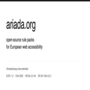

<!-- SPDX-FileCopyrightText: 2025-2026 Agonist Development AB -->
<!-- SPDX-License-Identifier: CC-BY-SA-4.0 -->

# @ariada-org/vscode-extension

Visual Studio Code extension that surfaces accessibility findings inline as you write HTML, JSX, TSX, Vue, and Svelte templates. Open source under EUPL-1.2.



## Install

The extension package is prepared for the VS Code Marketplace and Open VSX Registry. Once the account owner publishes it, install from the command palette:

```
ext install ariada.ariada-accessibility
```

To build from source inside the monorepo:

```sh
pnpm --filter @ariada-org/vscode-extension install
pnpm --filter @ariada-org/vscode-extension build
```

To create a local VSIX package without publishing:

```sh
pnpm --filter @ariada-org/vscode-extension exec vsce package
```

## Features

- Inline diagnostics (red and yellow squiggles) for the static-tractable subset of WCAG 2.2 rules.
- Hover tooltips with WCAG and EN 301 549 citations.
- Status-bar score widget showing an aggregate accessibility score.
- Commands to scan the current file, scan the workspace, refresh diagnostics, and copy citations.
- Multi-root workspace support.
- Zero telemetry. No network egress on activation.

## Marketplace packaging

The package metadata includes the Marketplace publisher, repository, issue tracker, homepage, EUPL-1.2 license reference, and a 128 by 128 PNG icon. `.vscodeignore` keeps sources, tests, coverage, maps, and local VSIX files out of the published artifact.

Publishing commands are intentionally split from packaging:

```sh
pnpm --filter @ariada-org/vscode-extension package
pnpm --filter @ariada-org/vscode-extension publish:vsce
pnpm --filter @ariada-org/vscode-extension publish:ovsx
```

Only the account owner should run the publish commands with Marketplace and Open VSX tokens.

## Rules in v0.1

The v0.1 release ships eight rules that can be inferred from source files alone:

| Rule ID                       | WCAG SC | EN 301 549 | Severity |
| ----------------------------- | ------- | ---------- | -------- |
| `wcag-22-1-1-1-image-alt`     | 1.1.1   | 9.1.1.1    | critical |
| `wcag-22-1-3-1-form-label`    | 1.3.1   | 9.1.3.1    | critical |
| `wcag-22-1-3-1-heading-order` | 1.3.1   | 9.1.3.1    | serious  |
| `wcag-22-2-4-4-link-purpose`  | 2.4.4   | 9.2.4.4    | serious  |
| `wcag-22-2-4-6-heading-empty` | 2.4.6   | 9.2.4.6    | serious  |
| `wcag-22-3-3-2-input-name`    | 3.3.2   | 9.3.3.2    | critical |
| `wcag-22-4-1-2-button-name`   | 4.1.2   | 9.4.1.2    | critical |
| `eaa-language-of-page`        | 3.1.1   | 9.3.1.1    | moderate |

Rules that require a live DOM (contrast, focus order, computed styles) are out of scope for v0.1 and are addressed by the companion `@ariada-org/cli` runner.

## Configuration

| Setting                       | Default | Description                         |
| ----------------------------- | ------- | ----------------------------------- |
| `ariada.enable`               | `true`  | Master switch                       |
| `ariada.scanOnType`           | `true`  | Re-scan as you type (debounced)     |
| `ariada.scanOnSave`           | `false` | Re-scan on file save                |
| `ariada.scanOnTypeDebounceMs` | `300`   | Debounce window in ms               |
| `ariada.severityThreshold`    | `minor` | Lowest severity to surface          |
| `ariada.statusBarEnabled`     | `true`  | Show the status-bar score widget    |
| `ariada.clearOnClose`         | `false` | Clear diagnostics on document close |
| `ariada.locale`               | `en`    | Tooltip and message language        |
| `ariada.telemetry.enabled`    | `false` | Reserved; v0.1 ships zero telemetry |

## Score formula (v0.1)

```
score = 100 − (10 × critical + 3 × serious + 1 × moderate)
```

Clamped to `[0, 100]`. This is the v0.1 placeholder formula; a canonical score engine is expected to replace it in a later release.

## License

EUPL-1.2. See `LICENSE`.
